<!-- TOC -->

- [单细胞数据分析](#单细胞数据分析)
  - [上游分析](#上游分析)
    - [数据下载](#数据下载)
      - [软件环境](#软件环境)
      - [使用sratools中的prefetch](#使用sratools中的prefetch)
      - [利用ascp由ftp.ncbi下载测序数据](#利用ascp由ftpncbi下载测序数据)
      - [提取fastq文件](#提取fastq文件)
    - [Cell Ranger](#cell-ranger)
      - [Cell Ranger软件安装](#cell-ranger软件安装)
      - [参考基因组序列的下载](#参考基因组序列的下载)
      - [mkfastq 拆分数据](#mkfastq-拆分数据)
      - [🔺count 细胞和基因的定量](#count-细胞和基因的定量)
      - [aggr多个文库的整合](#aggr多个文库的整合)
    - [关于上游分析得到的数据集](#关于上游分析得到的数据集)
  - [数据预处理工作流程](#数据预处理工作流程)
    - [QC质量检测](#qc质量检测)
    - [归一化数据](#归一化数据)
    - [识别高可变基因](#识别高可变基因)
    - [标准化数据](#标准化数据)
    - [执行线性降维](#执行线性降维)
    - [确定数据集的“维度”](#确定数据集的维度)
  - [整合多个scRNA-seq数据集](#整合多个scrna-seq数据集)
      - [与seurat标准处理流程一致](#与seurat标准处理流程一致)
      - [使用 SCTransform 规范化的数据集执行整合](#使用-sctransform-规范化的数据集执行整合)
  - [将 Seurat 与多模式数据一起使用](#将-seurat-与多模式数据一起使用)
  - [下游分析](#下游分析)
    - [细胞水平](#细胞水平)
      - [簇](#簇)
        - [聚类分析](#聚类分析)
        - [对簇进行细胞类型注释](#对簇进行细胞类型注释)
      - [构建单细胞轨迹](#构建单细胞轨迹)
    - [基因水平](#基因水平)
      - [基因的差异表达分析](#基因的差异表达分析)
        - [寻找差异表达的特征基因（簇生物标志物）](#寻找差异表达的特征基因簇生物标志物)
        - [与伪时间分析相关的差异表达分析](#与伪时间分析相关的差异表达分析)
      - [基因集分析](#基因集分析)
        - [表观遗传分析](#表观遗传分析)
        - [富集分析](#富集分析)
      - [基因调控网络分析](#基因调控网络分析)
        - [基因共表达](#基因共表达)
        - [蛋白质互作网络](#蛋白质互作网络)
        - [回归模型](#回归模型)
    - [](#)

<!-- /TOC -->
# 单细胞数据分析
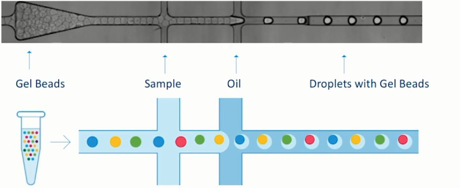
<br>一个油滴 (GEM)=一个单细胞+一个凝胶微珠=一个scRNA-Seq，可以说这就是10X的基本技术原理。

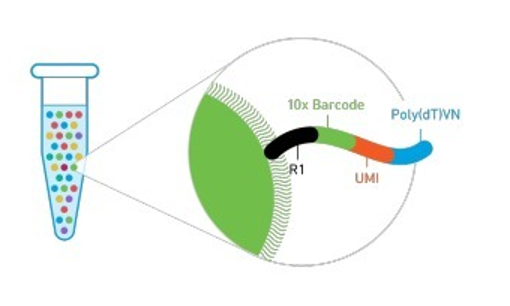

<br> Gel beads是由凝胶磁珠和磁珠上的一段引物构成，引物序列构成依次为：
* 全长Illumina TruSeq Read 1 测序引物（R1）
* 16nt 10X Barcode序列(Barcode)（每个Gel bead的10X Barcode均不相同，形成GEM（Gel Beads-in-emulsion）后用于区分细胞）
* 12 nt unique molecular identifier (UMI) （区分同一细胞的不同转录本并去除PCR Duplications，实现绝对定量）
* 30 nt poly dT反转录引物
## 上游分析
最常用且最常见的的数据集主要来自10X Genomics和Smart-seq2，目前大部分的单细胞数据都来自10X Genomics，因此后续的数据处理和分析以这该类数据为例子进行讲解。
### 数据下载
#### 软件环境
原始数据一般是以SRR格式存放，这个文件一般都要几个G，于是下载器首选ascp，但是直接使用ascp下载又需要配置一些参数，对于新手来说，最好是能提供一个ID，然后直接就下载，这个就需要用到`prefetch` 与`ascp`的组合了。
1. prefetch
   默认情况下，`prefetch`是利用https方式去下载原始数据。
    ```bash
    conda install -c daler sratoolkit
    prefetch -h # 可以显示帮助文档就说明安装成功
    # 如果要下载数据比如SRR文件，直接加ID号，指定输出目录就好
    prefetch SRRxxxxxxx -O PATH
    ```
2. ascp
`prefetch`速度有一定的限制。因此我们需要先安装一款叫做"aspera"的下载工具，它是IBM旗下的商业高速文件传输软件，与NCBI和EBI有协作合同。
    ```bash
    wget http://download.asperasoft.com/download/sw/connect/3.7.4/aspera-connect-3.7.4.147727-linux-64.tar.gz
    tar zxvf aspera-connect-3.7.4.147727-linux-64.tar.gz
    #安装
    bash aspera-connect-3.7.4.147727-linux-64.sh
    # 然后cd到根目录下看看是不是存在了.aspera文件夹，有的话表示安装成功
    cd && ls -a
    # 将aspera软件加入环境变量，并激活
    echo 'export PATH=~/.aspera/connect/bin:$PATH' >> ~/.bashrc
    source ~/.bashrc
    # 最后检查ascp是不是能用了
    ascp --help
    ```
如果报错：
```bash
ascp: Failed to open TCP connection for SSH, exiting.

Session Stop  (Error: Failed to open TCP connection for SSH)

# 官网给出的解决办法是：https://support.asperasoft.com/hc/en-us/articles/216126918-Error-44-UDP-session-initiation-fatal-error
On many Linux systems the default firewall can be configured with iptables. You will have to allow all incoming and outgoing traffic on UDP port 33001 (or whatever your Aspera UDP port is), which you can do with the following commands:
# 使用下面这两个命令(但需要管理员权限)
# iptables -I INPUT -p tcp --dport 33001 -j ACCEPT
# iptables -I OUTPUT -p tcp --dport 33001 -j ACCEPT
```
#### 使用sratools中的prefetch
以GSE117988的数据集为例。
1. 打开https://www.ncbi.nlm.nih.gov/geo/query/acc.cgi?acc=GSE117988
2. 点击SRA这里的`SRP155988`

3. `send to` => `Run Selector` => `Go` 
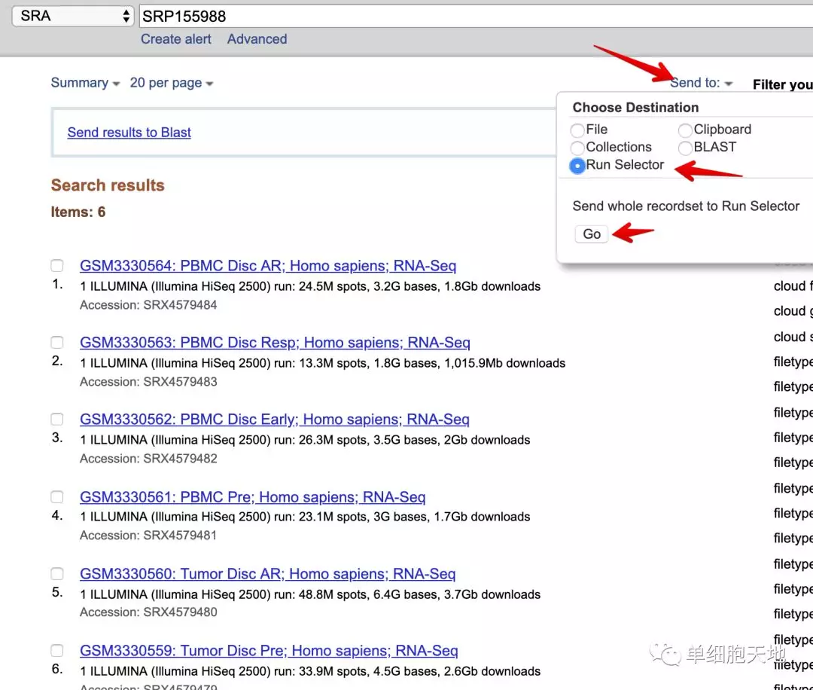
4. 下载Accession List，然后就得到了一个文本文件，列出了6个SRR ID号
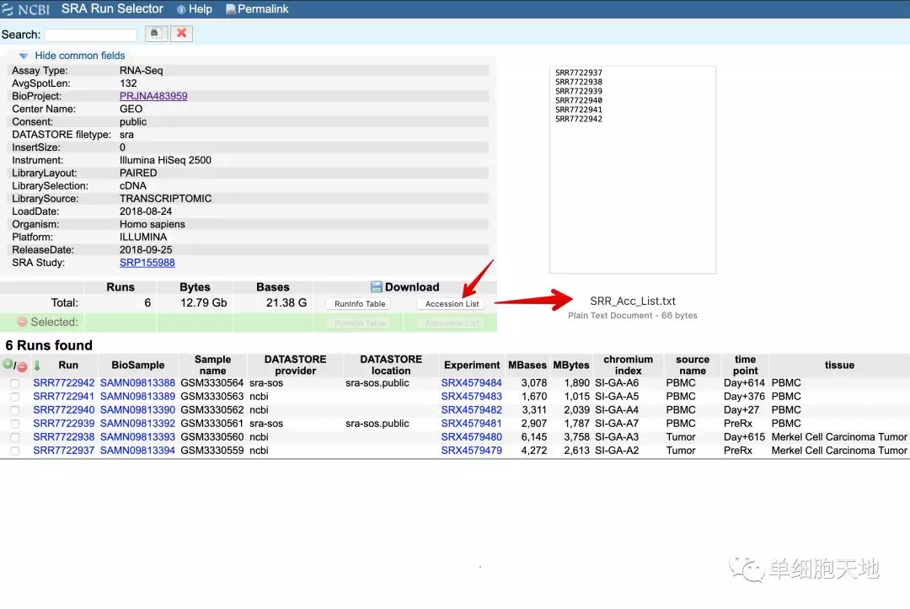
5. 下载代码
```bash
wkd=/home/project/single-cell/MCC
cd $wkd/raw
# for patient 2586-4
cat >SRR_Acc_List-2586-4.txt
SRR7722937
SRR7722938
SRR7722939
SRR7722940
SRR7722941
SRR7722942

cat SRR_Acc_List-2586-4.txt |while read i
do prefetch $i -O `pwd` && echo "** ${i}.sra done **"
done
# 一般2.6G文件下载2分钟左右
```
#### 利用ascp由ftp.ncbi下载测序数据
1. 进入官网https://www.ebi.ac.uk/ena ，搜索想下载的SRA号

2. 选择SRR这里
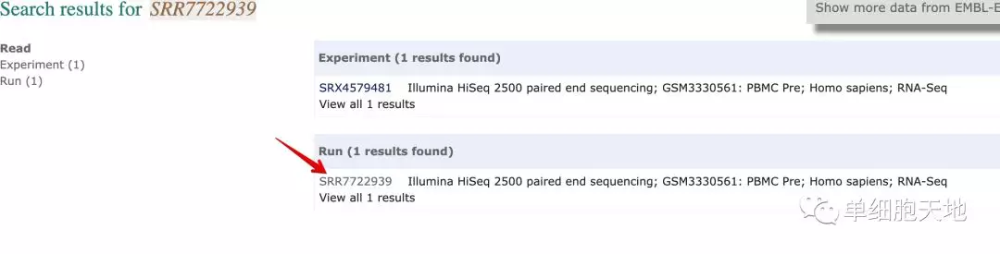
1. EBI可以直接下载fastq格式文件（左边方框），如果要下载sra就复制右边红色方框中链接
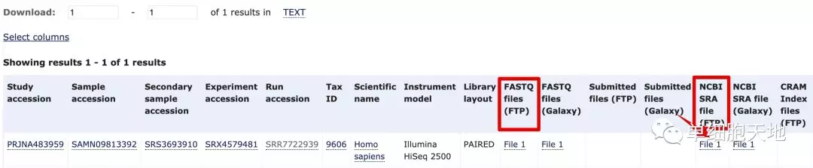
4. 然后利用这个代码下载
```bash
ascp -QT -l 300m -P33001 -i ~/.aspera/connect/etc/asperaweb_id_dsa.openssh era-fasp@fasp.sra.ebi.ac.uk:vol1/srr/SRR772/009/SRR7722939 ./
```
#### 提取fastq文件
我们使用fastq-dump这款软件，它是sra-tool中的一个工具，使用conda安装即可。
```bash
conda install -c bioconda sra-tools
```
```bash
wkd=/home/project/single-cell/MCC ///路径
cd $wkd/raw/P2586-4
cat SRR_Acc_List-2586-4.txt |while read i
do
time fastq-dump --gzip --split-files -A $i ${i}.sra && echo "** ${i}.sra to fastq done **"
done
```
* --gzip将生成的结果fastq文件进行压缩
* --split-files：首先它是分割的意思，-3实际上指的是分成3个文件。
* -A指定输出的文件名

根据Cell Ranger说明书对批量处理得到的三个文件更改名字方便后续分析：
```bash
# 比如，将原来的SRR7692286_1.fastq.gz改成SRR7692286_S1_L001_I1_001.fastq.gz
# 依次类推，将原来_2的改成R1，将_3改成R2
cat SRR_Acc_List-9245-3.txt | while read i ;do (mv ${i}_1*.gz ${i}_S1_L001_I1_001.fastq.gz;mv ${i}_2*.gz ${i}_S1_L001_R1_001.fastq.gz;mv ${i}_3*.gz ${i}_S1_L001_R2_001.fastq.gz);done
```
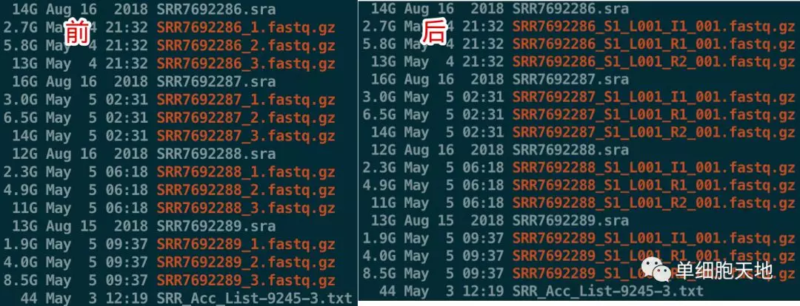
其中，<mark>I1为index，R1是barcode和UMI，R2是测序read，是最长的。</mark>

* **为什么10x单细胞转录组表达矩阵有3个文件**

    因为10x单细胞转录组表达矩阵里面的0值非常多，所以换成3个文件存储更节省空间。

### Cell Ranger
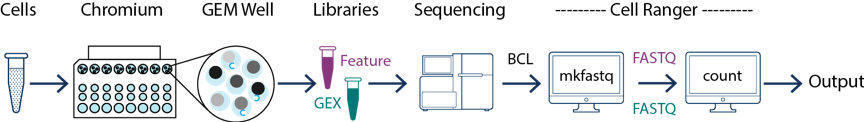
它主要包括四个主要基因表达分析流程：
* `mkfastq` ： 它借鉴了Illumina的`bcl2fastq` ，可以将一个或多个lane中的混样测序样本按照index标签生成样本对应的fastq文件
* `count`：利用`mkfastq`生成的fq文件，进行比对(基于STAR)、过滤、UMI计数。利用细胞的barcode生成gene-barcode矩阵，然后进行样本分群、基因表达分析。
* `aggr` ：接受cellranger count的输出数据，将同一组的不同测序样本的表达矩阵整合在一起，比如tumor组原来有4个样本，PBMC组有两个样本，现在可以使用aggr生成最后的tumor和PBMC两个矩阵，并且进行标准化去掉测序深度的影响
* `reanalyze` ：接受cellranger `count`或cellranger `aggr`生成的gene-barcode矩阵，使用不同的参数进行降维、聚类

它的结果主要是包含有细胞信息的BAM, MEX, CSV, HDF5 and HTML文件
#### Cell Ranger软件安装
Cell Ranger默认在本地运行(或者使用`--jobmode=local`指定)，它会占用90%的空余内存以及所有空余的CPU。如果要进行资源限制，可以使用`—localmem`或者`--localcores`
```bash
# 2.0版本下载(732M)
curl -o cellranger-2.0.2.tar.gz "http://cf.10xgenomics.com/releases/cell-exp/cellranger-2.0.2.tar.gz?Expires=1557256518&Policy=eyJTdGF0ZW1lbnQiOlt7IlJlc291cmNlIjoiaHR0cDovL2NmLjEweGdlbm9taWNzLmNvbS9yZWxlYXNlcy9jZWxsLWV4cC9jZWxscmFuZ2VyLTIuMC4yLnRhci5neiIsIkNvbmRpdGlvbiI6eyJEYXRlTGVzc1RoYW4iOnsiQVdTOkVwb2NoVGltZSI6MTU1NzI1NjUxOH19fV19&Signature=HoJUuPo4iTFdQgzFU1GH7uKf3uGitQxTjB6WOA9qGPlejf7tNcBPjO65WuSUZ~w8WWdeAvky-oV7XGfheY-bUr2b7QHr7jQEqc84cyU~PLvT~fYjkgC7cG7nlpbJOT~b7U~YH9amvR~SCLlyynp7scPDIA~9~keCYrIPgevTf2QyktybuSyjNTwugefOic~~XFkc9lrS~WQ9MNA1CLl4ExlQKsxWS77PEB6mwrMZXX65obDnZW9fIs3dIny6H5YoadbkgmsT52jmLien6PsG1g2jpAO90pPuHoru8LL64Q9gmB3I0nJAqi3EmrO3GKnUpHUhGb6doKmjSN6XccpmsA__&Key-Pair-Id=APKAI7S6A5RYOXBWRPDA"
# 2.1版本下载
curl -o cellranger-2.1.1.tar.gz "http://cf.10xgenomics.com/releases/cell-exp/cellranger-2.1.1.tar.gz?Expires=1557260110&Policy=eyJTdGF0ZW1lbnQiOlt7IlJlc291cmNlIjoiaHR0cDovL2NmLjEweGdlbm9taWNzLmNvbS9yZWxlYXNlcy9jZWxsLWV4cC9jZWxscmFuZ2VyLTIuMS4xLnRhci5neiIsIkNvbmRpdGlvbiI6eyJEYXRlTGVzc1RoYW4iOnsiQVdTOkVwb2NoVGltZSI6MTU1NzI2MDExMH19fV19&Signature=RNQd-gTASTQhtnUSBfQWrnqo6Pyy2wDXtV5tlxkG97727GvoRhMqFXbEsz4gJl2BMckdVvW3S1tZRwRo5pmxPzmhq-8RKxf99pGqlzo84HYqhbIRkxXlIbLbj-u3PUJqo8cesWpbSVSKkS2TCNS-9GMFNieQswqMS2-DN4BqoBOJnWr7T4wlOMd9hypXWwOsW2P2fqaM-WP2ooMyo-oIxm3y9gDghXdDEP5lvHU7GCQcFGGexkdIrD6S5p8JPJ1DB5XieGrtEuP1YVp6tLMGXFoRWXS8dQLI1egWDYlOuRaiQgLIb3o5ZxBg5NpzLPP5kDHMAVzJFdBpf~~rkyNYTA__&Key-Pair-Id=APKAI7S6A5RYOXBWRPDA"
### 解压
tar zxvf cellranger-2.0.2.tar.gz
```
#### 参考基因组序列的下载
1. 根据需求下载基因组注释文件
以下文件是基于ensebl数据库的hg38人类基因组注释文件，但是不能直接使用网站下载的基因组与注释文件，需要过滤一下。
```bash
curl -O http://cf.10xgenomics.com/supp/cell-exp/refdata-cellranger-GRCh38-1.2.0.tar.gz
# 然后解压
tar -xzvf refdata-cellranger-GRCh38-1.2.0.tar.gz
```
2. 自己尝试构建(重点和难点)
但是很多时候，我们需要根据自己的需要，自定义一套参考信息，但需要注意以下问题：
* 参考序列只能有很少的 overlapping gene annotations，因为reads比对到多个基因会导致流程检测的分子数更少(它只要uniquely mapped的结果)
* FASTA与GTF比对和STAR兼容，GTF文件的第三列（feature type）必须有exon
```bash
# 下载基因组
wget ftp://ftp.ensembl.org/pub/release-84/fasta/homo_sapiens/dna/Homo_sapiens.GRCh38.dna.primary_assembly.fa.gz
gunzip Homo_sapiens.GRCh38.dna.primary_assembly.fa.gz
# 下载注释
wget ftp://ftp.ensembl.org/pub/release-84/gtf/homo_sapiens/Homo_sapiens.GRCh38.84.gtf.gz
gunzip Homo_sapiens.GRCh38.84.gtf.gz
# 软件构建注释
# 首先利用mkgtf过滤GTF文件
# mkgtf <input_gtf> <output_gtf> [--attribute=KEY:VALUE...]
cellranger mkgtf Homo_sapiens.GRCh38.84.gtf Homo_sapiens.GRCh38.84.filtered.gtf \
                --attribute=gene_biotype:protein_coding \
                --attribute=gene_biotype:lincRNA \
                --attribute=gene_biotype:antisense \
                --attribute=gene_biotype:IG_LV_gene \
                --attribute=gene_biotype:IG_V_gene \
                --attribute=gene_biotype:IG_V_pseudogene \
                --attribute=gene_biotype:IG_D_gene \
                --attribute=gene_biotype:IG_J_gene \
                --attribute=gene_biotype:IG_J_pseudogene \
                --attribute=gene_biotype:IG_C_gene \
                --attribute=gene_biotype:IG_C_pseudogene \
                --attribute=gene_biotype:TR_V_gene \
                --attribute=gene_biotype:TR_V_pseudogene \
                --attribute=gene_biotype:TR_D_gene \
                --attribute=gene_biotype:TR_J_gene \
                --attribute=gene_biotype:TR_J_pseudogene \
                --attribute=gene_biotype:TR_C_gene

# gene_biotype（也就是基因的生物类型）的键值对
$ cat Homo_sapiens.GRCh38.84.filtered.gtf |grep -v "#" |awk -v FS='gene_biotype ' 'NF>1{print $2}'|awk -F ";" '{print $1}'|sort | uniq -c

   213 "IG_C_gene"
    33 "IG_C_pseudogene"
   152 "IG_D_gene"
    76 "IG_J_gene"
     9 "IG_J_pseudogene"
  1209 "IG_V_gene"
   646 "IG_V_pseudogene"
   125 "TR_C_gene"
    16 "TR_D_gene"
   316 "TR_J_gene"
    12 "TR_J_pseudogene"
   848 "TR_V_gene"
   110 "TR_V_pseudogene"
 45662 "antisense"
 58181 "lincRNA"
2337766 "protein_coding"

# 利用mkref构建参考索引，软件利用构建好的注释，去构建需要的基因组
cellranger mkref --genome=GRCh38 \
                --fasta=Homo_sapiens.GRCh38.dna.primary_assembly.fa \
                --genes=Homo_sapiens.GRCh38.84.filtered.gtf \
                --ref-version=1.2.0
```
#### mkfastq 拆分数据
<mark>一般来说，这个步骤我们不会使用，从数据库下载可以得到fastq文件，而且数据库一般不会给出BCLs格式的原始文件。
目的：<mark>将每个flowcell 的Illumina sequencer's base call files (BCLs)转为fastq文件</mark>

特色： 它借鉴了Illumina出品的`bcl2fastq`，另外增加了：
* 将10X 样本index名称与四种寡核苷酸对应起来，比如A1孔是样本SI-GA-A1，然后对应的寡核苷酸是GGTTTACT, CTAAACGG, TCGGCGTC, and AACCGTAA ，那么程序就会去index文件中将存在这四种寡核苷酸的fastq组合到A1这个样本
* 提供质控结果，包括barcode 质量、总体测序质量如Q30、R1和R2的Q30碱基占比、测序reads数等
* 可以使用10X简化版的样本信息表
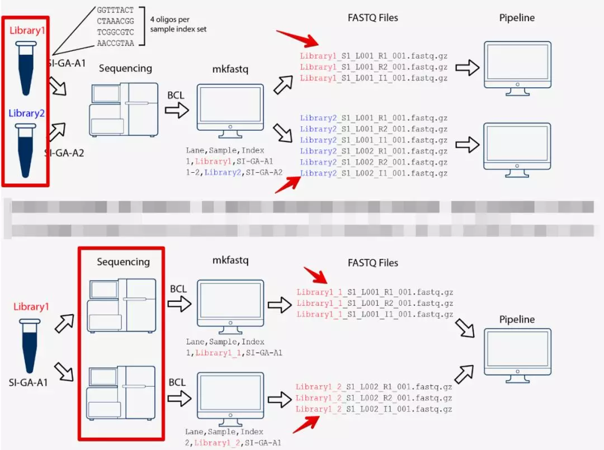
```bash
# 第一种
$ cellranger mkfastq --id=bcl \
                    --run=/path/to/bcl \
                    --samplesheet=samplesheet-1.2.0.csv
                    --jobmode=local 
                    --localcores=20 
                    --localmem=80
# 第二种
$ cellranger mkfastq --id=bcl \
                    --run=/path/to/bcl \
                    --csv=simple-1.2.0.csv
                    --jobmode=local 
                    --localcores=20 
                    --localmem=80
# 其中id指定输出目录的名称
# run指的是下机的原始BCL文件目录
# -–samplesheet ：样品信息列表--共三列（lane id ,sample name ,index name)，注意要控制好核心数和内存数
```
#### 🔺count 细胞和基因的定量
这个过程是最重要的，它完成细胞与基因的定量，它将比对、质控、定量都包装了起来。
```bash
# 这是示例，不是真实数据 #
cellranger count --id=sample345 \
                  --transcriptome=/opt/refdata-cellranger-GRCh38-1.2.0 \
                  --fastqs=/home/scRNA/runs/HAWT7ADXX/outs/fastq_path \
                  --sample=mysample \
                  --expect-cells=1000 \
                  --nosecondary
# id指定输出文件存放目录名
# transcriptome指定与CellRanger兼容的参考基因组
# fastqs指定mkfastq或者自定义的测序文件
# sample要和fastq文件的前缀中的sample保持一致，作为软件识别的标志
# expect-cells指定复现的细胞数量，这个要和实验设计结合起来
# nosecondary 只获得表达矩阵，不进行后续的降维、聚类和可视化分析(因为后期会自行用R包去做)
```
输出文件：
* web_summary.html：官方说明 summary HTML file 
* metrics_summary.csv：CSV格式数据摘要
* possorted_genome_bam.bam：比对文件
* possorted_genome_bam.bam.bai：索引文件
* <mark>filtered_gene_bc_matrices：是重要的一个目录，下面又包含了 barcodes.tsv.gz、features.tsv.gz、matrix.mtx.gz，是下游Seurat、Scater、Monocle等分析的输入文件</mark>
* filtered_feature_bc_matrix.h5：过滤掉的barcode信息HDF5 format
* raw_feature_bc_matrix：原始barcode信息
* raw_feature_bc_matrix.h5：原始barcode信息HDF5 format
* <mark>analysis：数据分析目录，下面又包含聚类clustering（有graph-based & k-means）、差异分析diffexp、主成分线性降维分析pca、非线性降维tsne</mark>
* molecule_info.h5：下面进行aggregate使用的文件
* cloupe.cloupe：官方可视化工具Loupe Cell Browser 输入文件
#### aggr多个文库的整合
当处理多个生物学样本或者一个样本存在多个重复/文库时，最好的操作就是先分别对每个文库进行单独的count定量，然后将定量结果利用aggr组合起来。
1.  得到count结果
2.  构建Aggregation CSV
```bash
# AGG123_libraries.csv
library_id,molecule_h5
LV123,/opt/runs/LV123/outs/molecule_info.h5
LB456,/opt/runs/LB456/outs/molecule_info.h5
LP789,/opt/runs/LP789/outs/molecule_info.h5
# 其中
# molecule_h5：文件molecule_info.h5 file的路径
```
3. 运行aggr
```bash
cellranger aggr --id=AGG123 \
                 --csv=AGG123_libraries.csv \
                 --normalize=mapped
# 结果输出到AGG123这个目录中
```
### 关于上游分析得到的数据集
e.g.10X Genomics 免费提供的外周血单核细胞 (PBMC) 数据集
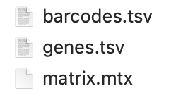
* barcodes.tsv：每个细胞的编码，由ATCG四个碱基排列组合形成的不同的14个碱基组合
* genes.tsv：基因的ensembl ID 和gene symbol
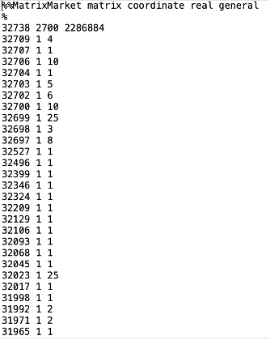
* matrix.mtx：每个细胞不同基因所测得的表达矩阵，第一列是基因ID，与genes.tsv进行对应转换；第二列是细胞的编号，与barcodes.tsv进行匹配；第三列是基因的表达量（TPM）。

## 数据预处理工作流程
**加载Seurat包和读取数据**

使用Read10X()函数读取数据文件，并构建成<mark>行名为基因名，列名为细胞的barcode的 (UMI) 计数矩阵</mark>，其中可储存单细胞数据集的稀疏矩阵和后续分析结果。
```r
# BiocManager::install("Seurat")
library(dplyr)
library(Seurat)
library(patchwork)

# Load the PBMC dataset
pbmc.data<-Read10X(data.dir= "../data/pbmc3k/filtered_gene_bc_matrices/hg19/")
# Initialize the Seurat object with the raw (non-normalized data).
pbmc <- CreateSeuratObject(counts = pbmc.data, project = "pbmc3k", min.cells = 3, min.features = 200)
pbmc
```
### QC质量检测
> QC质量指标：
* 每个细胞检测到的基因数目
  * 低质量细胞或空液滴通常只有很少的基因

  * 细胞双联体或多重联体可能表现出异常高的基因计数
* 每个细胞中检测到的分子总数
* 低质量/垂死的细胞通常表现出广泛的线粒体污染，所以使用该PercentageFeatureSet()函数计算线粒体 QC 指标，其中MT-开头的基因认为是线粒体基因
```r
 ###### 细胞质控
  ### 计算质控指标
  # 计算细胞中线粒体基因比例
  pbmc[["percent.mt"]] <- PercentageFeatureSet(pbmc, pattern = "^MT-")
  # 质控前小提琴图
  plots = list()
  for(i in seq_along(plot.featrures)){
    plots[[i]] = VlnPlot(pbmc, group.by=group, pt.size = 0,
   features = plot.featrures[i]) + theme.set2 + NoLegend()}
  violin <- wrap_plots(plots = plots, nrow=2)    
 ggsave("QC/vlnplot_before_qc.pdf", plot = violin, width = 9, height = 8) 
```
因此，我们通过将QC指标可视化，并使用这些指标来过滤不符合指标的细胞。<br>

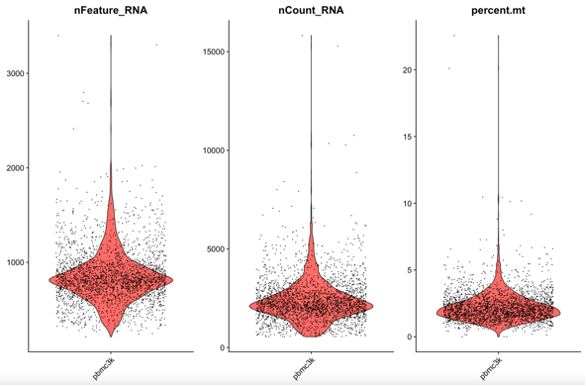

<br>从图中我们可以观察到nFeature_RNA，nCount_RNA和percent.mt的数量大部分都在小提琴图的底部，因此需要过滤低质量的细胞，其中nCount_RNA为每个细胞的UMI数目，nFeature_RNA为每个细胞所检测到的基因数目。
<br><mark>通常，我们过滤具有超过 2,500 或少于 200 的基因数目的细胞和线粒体计数 > 5% 的细胞。</mark>

```r
### 质控
  # 设置质控标准
  minGene=500
  maxGene=2500
  maxUMI=22000
  pctMT=5
  # 数据质控并绘制小提琴图
pbmc <- subset(pbmc, subset = nFeature_RNA > minGene & nFeature_RNA < maxGene & nCount_RNA < maxUMI & percent.mt < pctMT )
plots = list()
for(i in seq_along(plot.featrures)){
plots[[i]] = VlnPlot(pbmc, group.by=group, pt.size = 0.01,features = plot.featrures[i]) + theme.set2 +NoLegend()}
violin <- wrap_plots(plots = plots, nrow=1)    
ggsave("QC/vlnplot_after_qc.pdf", plot = violin, width = 9, height = 8)
```
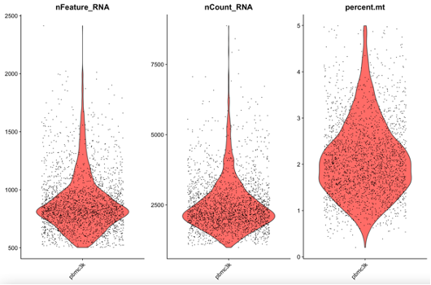
关于核糖体和红细胞的质控根据需求选择是否需要，若需要，在上一步代码添加新的质控指标。
```r
# 计算细胞中核糖体基因比例
  pbmc[["percent.rb"]] <- PercentageFeatureSet(pbmc, pattern = "^RP[LS]")
# 计算红细胞比例，检测是否有被血污染
  HB.genes <- c("HBA1","HBA2","HBB","HBD","HBE1","HBG1","HBG2","HBM","HBQ1","HBZ")
  HB.genes <- CaseMatch(HB.genes, rownames(pbmc))
  pbmc[["percent.HB"]]<-PercentageFeatureSet(pbmc, features=HB.genes) 
```
> 检测doublets
* Doublets：单个液滴(droplet)捕获一个条形码珠(barcode bead)和多个细胞核，导致了异常高的基因计数。
* <mark>！！！</mark>一般来说，建议检测doublets在QC的质控nFeature_RNA步骤之前，先去除异常高的基因计数对后续QC效果更好。且一般在聚类步骤或者细胞类型注释之后去除doublets效果更好，因为这样能从图中清楚看到哪一些细胞是在簇的边缘和属于哪一类的细胞，而这一些边缘的细胞一般来说是doublets。
* <mark>去除doublets之后，再对其余的原始counts矩阵进行新一轮的Seurat的标准分析流程。</mark>
1. DoubletFinder包
*（与Seurat的交互：在seurat标准流程进行到t-SNE和UMAP降维之后，FindAllMarkers之前进行DoubletFinder操作。）*

原理：从现有的矩阵的细胞中根据我们预先定义好的细胞类型模拟一些双细胞出来（比如单核和T细胞的双细胞、B细胞和中性粒细胞的双细胞等等），将模拟出的双细胞和原有矩阵的细胞混合在一起，进行降维聚类，原则上人工模拟的doublets会与真实的doublets距离较近，因此计算每个细胞K最近邻细胞中人工模拟doublets的比例 (pANN)，就可以根据pANN值对每个barcode的doublets概率进行排序。另外依据泊松分布的统计原理可以计算每个样本中doublets的数量，结合之前的细胞pANN值排序，就可以过滤doublets了。
```r
devtools::install_github('chris-mcginnis-ucsf/DoubletFinder')
library(DoubletFinder)
  ## 检测doublets
  pc.num=1:10
  # 寻找最优pK值
  sweep.res.list <- paramSweep_v3(pbmc, PCs = pc.num, sct = T) #使用log标准化，sct参数设置为 sct = F（默认 ）,如使用SCT标准化方法，设置为T
  saveRDS(sweep.res.list, "QC/sweep.res.list.rds")
# 当GT设置为 TRUE时，可用于ROC分析。 默认设置为 FALSE。
  sweep.stats <- summarizeSweep(sweep.res.list, GT = FALSE)  
  bcmvn <- find.pK(sweep.stats) #可以看到最佳参数的点
  # 提取最佳pk值
  pK_bcmvn <- bcmvn$pK[which.max(bcmvn$BCmetric)] %>% as.character() %>% as.numeric()
  # 排除不能检出的同源doublets，优化期望的doublets数量，双细胞有两种，同源双细胞和异源双细胞。DoubletFinder只能检测异源双细胞。所以需要把同源双细胞可能的比率去除掉，以优化期望的doublets数量。
# 按每增加1000个细胞，双细胞比率增加千分之8来计算 
DoubletRate = ncol(pbmc)*8*1e-6 
# 估计同源双细胞比例，根据modelHomotypic()中的参数为人为混合双细胞。这里是从seurat_clusters中来混双细胞 
  homotypic.prop <- modelHomotypic(pbmc$SingleR)
# 该部分使用SingleR后的数据是为了可视化哪些类型的细胞中有doublets 
  nExp_poi <- round(DoubletRate*ncol(pbmc))  # 计算双细胞比例
  nExp_poi.adj <- round(nExp_poi*(1-homotypic.prop))  # 使用同源双细胞比例对计算的双细胞比例进行校正
  # 使用确定好的参数鉴定doublets
  pbmc <- doubletFinder_v3(pbmc, PCs = pc.num, pN = 0.25, pK = pK_bcmvn, nExp = nExp_poi.adj, reuse.pANN = F, sct = T)
# 可视化结果
  names(pbmc@meta.data) = gsub("DF.classifications.*", "DF.classifications", colnames(pbmc@meta.data))  
  p1 <- DimPlot(pbmc, group.by = "DF.classifications") + scale_color_manual(values = c("red", "gray"))
  p2 <- DimPlot(pbmc, label = T)
  p <- p1|p2
  ggsave("QC/Doublets_DFpred.pdf", p, width = 12, height = 5)
```
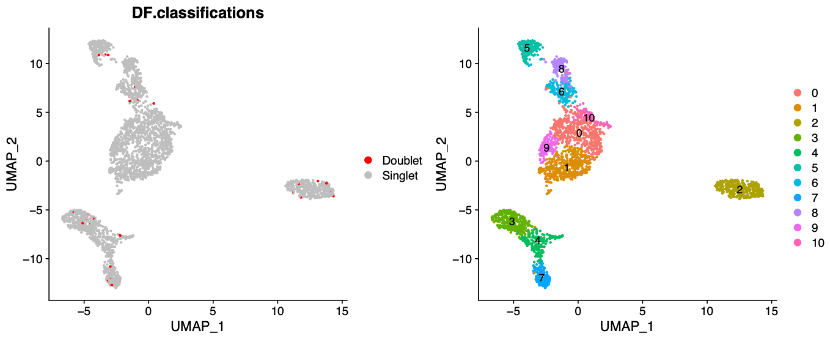
<br>
2. Scrublet包(python)
原理：给定一个原始的（未归一化的）UMI矩阵，以细胞为行，基因为列的矩阵counts_matrix计数，计算每个单元的多细胞得分。

> 注意事项：
1. 处理来自多个样本的数据时，请分别对每个样本运行Scrublet。 因为Scrublet旨在检测由两个细胞的随机共封装形成的technical doublets，所以在merged数据集上可能会表现不佳，因为细胞类型比例不代表任何单个样品； 
2. 检查doublet score阈值是否合理，并在必要时进行手动调整。并不是所有情况向下doublet score的直方分布图都是呈现标准的双峰； 
3. UMAP或t-SNE可视化的结果中，预测的双细胞应该大体上共定位（可能在多个细胞群中）。如果不是，则可能需要调整doublet score阈值，或更改预处理参数以更好地解析数据中存在的细胞状态。
```python
import scrublet as scr
import scipy.io
import matplotlib.pyplot as plt
import numpy as np
import os
import pandas as pd
input_dir = '.../pbmc3k_filtered_gene_bc_matrices/filtered_gene_bc_matrices/hg19'
counts_matrix = scipy.io.mmread(input_dir + '/matrix.mtx').T.tocsc()
genes = np.array(scr.load_genes(input_dir + '/genes.tsv', delimiter='\t', column=1))
out_df = pd.read_csv(input_dir + '/barcodes.tsv', header = None, index_col=None, names=['barcode'])
# 初始化Scrublet对象，expected_doublet_rate通常为0.05-0.1，结果对该参数不敏感
scrub = scr.Scrublet(counts_matrix, expected_doublet_rate=0.06)
# 计算doublet score
doublet_scores, predicted_doublets = scrub.scrub_doublets(min_counts=2, min_cells=3, min_gene_variability_pctl=85, n_prin_comps=30)
```
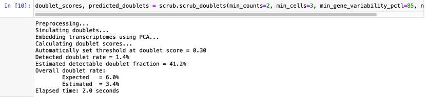
```python
# 绘制doublet score分布直方图
scrub.call_doublets(threshold=0.30)
# 如果自动阈值检测效果不佳，则可以使用call_doublets()函数调整阈值
# Doublet score分布直方图包括观察到的转录组和模拟的doublet，模拟的doublet直方图通常是双峰的。
# 画doublet score直方图
scrub.plot_histogram()
### 理想情况下，阈值应在模拟doublet直方图的两种模式之间设置最小值
```
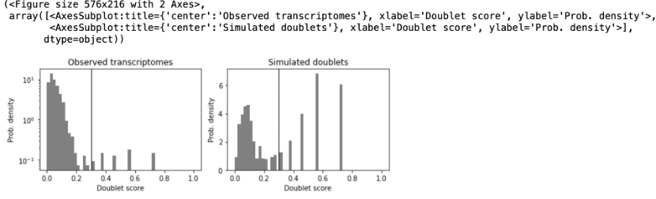
```python
# 降维可视化
print('Running UMAP...')
scrub.set_embedding('UMAP', scr.get_umap(scrub.manifold_obs_, 10, min_dist=0.3))
print('Done.')
### UMAP可视化
scrub.plot_embedding('UMAP', order_points=True)
```
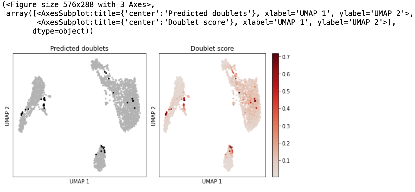
```python
# doublets占比
print (scrub.detected_doublet_rate_)
# 0.014074074074074074
# 把doublets预测结果保存到文件，后续用Seurat等软件处理的时候可以导入doublets的预测结果对barcode进行筛选。
out_df['doublet_scores'] = doublet_scores
out_df['predicted_doublets'] = predicted_doublets
out_df.to_csv(input_dir + '/doublet.txt', index=False,header=True)
out_df.head()
```
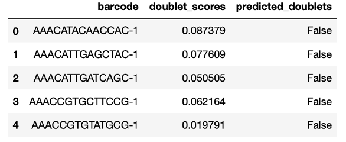
### 归一化数据
我们采用<mark>全局缩放归一化方法“LogNormalize”</mark>，该方法将每个细胞的特征表达式测量值与总表达式进行归一化，乘以一个比例因子（默认为 10,000），并对结果进行对数转换。将有量纲的表达式，经过变换，化为无量纲的表达式，标准化值存储在`pbmc[["RNA"]]@data`。
```r
pbmc <- NormalizeData(pbmc, normalization.method = "LogNormalize", scale.factor = 10000)
```
### 识别高可变基因
* 高可变基因：在某些细胞中高度表达，而在其他细胞中表达低（在下游分析中关注这些基因有助于突出单细胞数据集中的生物信号。）
* 使用均值与方差之间的关系，来挑选高变基因，默认返回前2000个高变基因进入下游分析，如PCA。
```r
pbmc <- FindVariableFeatures(pbmc, selection.method = "vst", nfeatures = 2000)

# Identify the 10 most highly variable genes
top10 <- head(VariableFeatures(pbmc), 10)

# plot variable features with and without labels
plot1 <- VariableFeaturePlot(pbmc)
plot2 <- LabelPoints(plot = plot1, points = top10, repel = TRUE)
plot1 + plot2
```
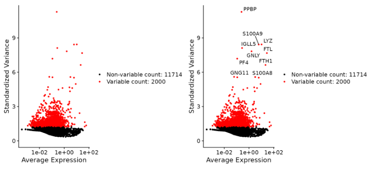
### 标准化数据
在降维技术（如 PCA）之前的标准预处理步骤，使用ScaleData()函数，使数据符合标准正态分布，因为PCA分析默认数据是服从正态分布，其结果存储在pbmc[["RNA"]]@scale.data。
ScaleData()函数：

* 改变每个基因的表达，使跨细胞的平均表达为 0
* 缩放每个基因的表达，使细胞间的方差为 1
``` r
all.genes <- rownames(pbmc)
pbmc <- ScaleData(pbmc, features = all.genes)
```
> SCTransform()函数

<mark>可以代替以上三个处理步骤的函数（NormalizeData,
ScaleData,FindVariableFeatures）的运行。</mark>这是一个用方差稳定变换对单细胞UMI count 数据标准化的方法，方差稳定变换是基于负二项回归。这个函数在对数据进行均一化的同时还可以去除线粒体红细胞等混杂因素的影响。
优点：
* 对测序深度的校正效果要好于log归一化。（10万以内的细胞都建议使用SCT标准化）
* SCTransform对测序深度的校正效果很好，也可用于校正线粒体等因素的影响，但不能用于批次校正。
```r
pbmc <- NormalizeData(pbmc) %>% FindVariableFeatures(nfeatures = 2000) %>% ScaleData(vars.to.regress = "percent.mt"))
 
pbmc <- SCTransform(pbmc, vars.to.regress = "percent.mt")
```
以上两行代码功能相同。

### 执行线性降维

1. PCA主成分分析
接下来，我们对标准化后的数据进行PCA分析。默认的，只是用前面决定的高变基因进行PCA分析，也可以使用features参数设置用户自己选择的基因进行PCA分析。

```R
pbmc <- RunPCA(pbmc, features = VariableFeatures(object = pbmc))
# Examine and visualize PCA results a few different ways
print(pbmc[["pca"]], dims = 1:5, nfeatures = 5)
VizDimLoadings(pbmc, dims = 1:2, reduction = "pca")
DimPlot(pbmc, reduction = "pca")
```
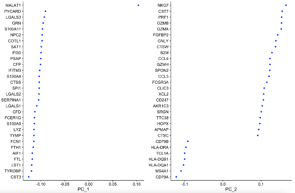
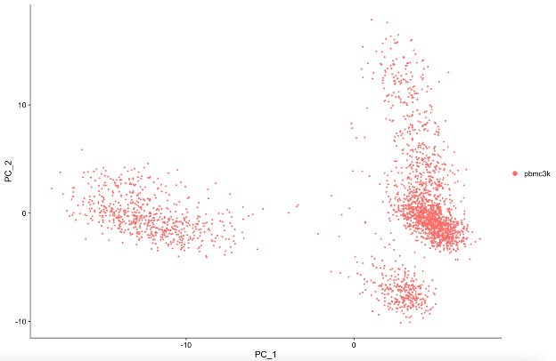
```r
### DimHeatmap()允许我们探索数据中的最初的异质性，然后决定下游使用多少个PC进行分析。
DimHeatmap(pbmc, dims = 1, cells = 500, balanced = TRUE)
DimHeatmap(pbmc, dims = 1:15, cells = 500, balanced = TRUE)
```
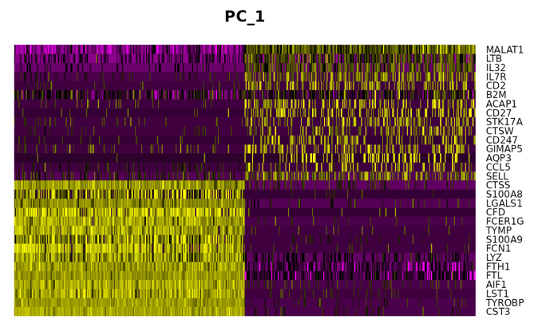
2. NMF非负矩阵分解
<mark>（一般在PCA后再使用NMF，使得因子解释性更高）</mark>
<br>* 矩阵分解的方法有很多种，如奇异值分解 (singular value decomposition, SVD) 、独立成分分析 (independent component analysis, ICA) 、主成分分析 (principal component analysis, PCA) 等。这些方法的共同特点是，即使初始矩阵V元素是非负的，分解出来的因子 W 和 H 中的元素往往含有负值元素。从计算科学的角度来看，分解出来的因子 W 和 H 中的元素含有负值元素并没有问题， 但负值元素通常是无法解释的。
<br>* 非负矩阵分解(Non-negative Matrix Factorization, NMF)本质上说是一种矩阵分解的方法，最重要的特点是非负性约束,对于任意给定的一个非负矩阵V，NMF算法能够寻找到一个非负矩阵W和一个非负矩阵H，使得 V≈W*H成立 ，从而将一个非负的矩阵分解为左右两个非负矩阵的乘积。
<br>* 相比于PCA的优势：虽然NMF运行的时间比PCA时间更长，但它分解的因子很容易与细胞类型或表达模式对应起来，即NMF的因子可解释性更强。

```r
### 关于NMF的函数
nmf(x, rank, method, seed, nrun, ...)
x：待分解非负矩阵，数据格式可以是matrix，data.frame， ExpressionSet
rank：分解的基数量，对于单细胞数据，可以设置为期望的细胞类型数量或表达模式数量
method：因式分解的常用方法，这里介绍三种常用的
        1、基于KL 散度进行度量目标函数的多重迭代梯度下降算法——brunet(默认算法)
        2、基于欧几里得距离度量目标函数的多重迭代梯度下降算法——lee
        3、交替最小二乘法(Alternating Least Squares(ALS))——snmf/r  
seed：因式分解的初始化种子    
nrun：运行次数 
运行代码：
# 安装NMF基础包
BiocManager::install('Biobase')
install.packages('NMF')
library(Seurat)
library(tidyverse)
library(NMF)
rm(list = ls())

pbmc <- NormalizeData(pbmc) %>% FindVariableFeatures() %>% ScaleData(do.center = F)###重新进行标准化和归一化，设置do.center = F可以不会出现负值
vm <- pbmc@assays$RNA@scale.data
saveRDS(vm, file = "pbmc_vm.rds")
res <- nmf(vm, 12, method = "snmf/r")#很慢，rank值选择比目的预期的细胞类型/细胞状态稍大的值，因为分解的一些因子回复即到线粒体核糖体等噪音，而不会落到一个具体的细胞亚群上
save(res, file = "pbmc_nmf_res.rda" )
## 分解结果返回suerat对象
pbmc@reductions$nmf <- pbmc@reductions$pca
pbmc@reductions$nmf@cell.embeddings <- t(coef(res))    
pbmc@reductions$nmf@feature.loadings <- basis(res)  

# 提取分解得到的每个因子
#每个因子提取30个
fs <- extractFeatures(res, 30L)
fs <- lapply(fs, function(x) rownames(res)[x])
fs <- do.call("rbind", fs)
rownames(fs) <- paste0("cluster", 1:12)
write.csv(t(fs), "NMF_TopGenes. csv")
DT::datatable(t(fs))

# 选择用于后续分析的因子，使用NMF运行的结果进行降维聚类
###选择用于后续分析的因子
s.f <- 1:12
#因子1主要是线粒体和核糖体
##降维
cell1 <- colnames(pbmc)
cel12 <- colnames(coef(res))
cells <- intersect(cell1, cel12)
pbmc<<-pbmc[,cells]
pbmc <- RunPCA(pbmc,verbose = F)
pbmc@reductions$nmf <- pbmc@reductions$pca
pbmc@reductions$nmf@cell.embeddings <- t(coef(res)[,cells])
pbmc@reductions $nmf@feature.loadings <- basis(res)
pbmc <- RunUMAP(pbmc, reduction= 'nmf',dims=s.f)
##基于NMF降维矩阵的聚类
pbmc <- FindNeighbors(pbmc, reduction= 'nmf', dims=s.f) %>% FindClusters()
##基于因子最大载荷分类
pbmc$cluster <- apply(NMF::coefficients(res)[s.f,], 2,which.max)

# 降维聚类结果可视化
p1 <- DimPlot(pbmc, label = T) + ggtitle("Clustered by Louvain")
p2 <- DimPlot(pbmc, group.by = "cluster", label = T) + ggtitle("Clustered by maxloading")
pc <- p1|p2
ggsave(" pbmc_NMF_Cluster.pdf", pc, width = 10, height = 5)
```

### 确定数据集的“维度”
为了克服 scRNA-seq 数据的任何单个特征中的广泛技术噪音，Seurat 根据其 PCA 分数对细胞进行聚类，每个 PC 基本上代表一个“综合特征”，该“综合特征”组合了相关特征集的信息。因此，顶部主成分代表数据集的稳健压缩的信息。但是，我们应该选择多少个PC进行分析？
1. JackStraw 程序启发的重采样测试。我们随机置换数据的一个子集（默认为 1%）并重新运行 PCA，构建特征分数的“零分布”，并重复此过程。我们将“显着”PC 识别为那些具有大量低 p 值特征的 PC。
```r
# NOTE: This process can take a long time for big datasets, comment out for expediency. More
# approximate techniques such as those implemented in ElbowPlot() can be used to reduce
# computation time
pbmc <- JackStraw(pbmc, num.replicate = 100)
pbmc <- ScoreJackStraw(pbmc, dims = 1:20)
```
2. 该JackStrawPlot()函数提供了一个可视化工具，用于将每个 PC 的 p 值分布与均匀分布（虚线）进行比较。“显著”PC 将显示出大量具有低 p 值的特征（虚线上方的实线）。在这种情况下，在前 10-12 个 PC 之后，重要性似乎急剧下降。
```r
JackStrawPlot(pbmc, dims = 1:15)
```
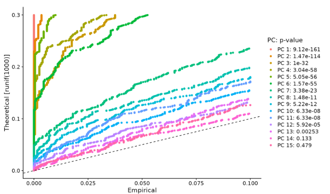
3. 肘图（碎石图）：基于每个（ElbowPlot()函数）解释的方差百分比对主成分进行排名。在这个例子中，我们可以观察到 PC9-10 周围的“肘部”，这表明大部分真实信号是在前 10 个 PC 中捕获的。
```r
ElbowPlot(pbmc)
```
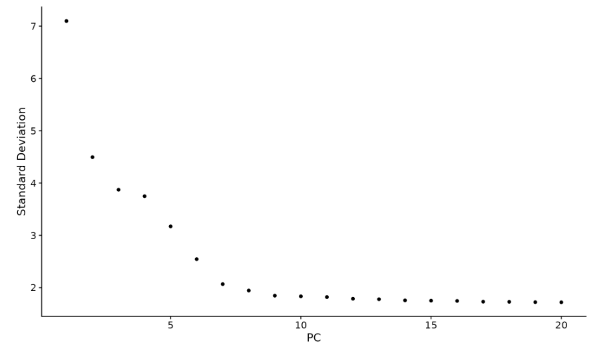

## 整合多个scRNA-seq数据集

----------------------------------------------------

#### 与seurat标准处理流程一致

<mark>两个或多个单细胞数据集的联合分析。</mark>在标准工作流程下，识别存在于多个数据集中的细胞群可能会出现问题。Seurat v4 包括一组方法来匹配（或“对齐”）跨数据集的共享细胞群。这些方法首先识别处于匹配生物学状态（“锚”）的跨数据集细胞对，既可用于校正数据集之间的技术差异（即批量效应校正），也可用于进行比较的 scRNA-seq 分析跨实验条件。

我们展示了[Stuart*、Butler* 等人 2019 年](https://www.cell.com/cell/fulltext/S0092-8674(19)30559-8)所述的 scRNA-seq 整合方法，以对处于[静息或干扰素刺激状态](https://www.nature.com/articles/nbt.4042)的人类免疫细胞 (PBMC) 进行比较分析。

```R
# Setup the Seurat objects
library(Seurat)
library(SeuratData)
library(patchwork)

# load dataset
LoadData("ifnb")

# load seurat data(a sample)
dir <- dir("data/")
dir <- paste0("data/", dir)
samples_name = c('ctrl', 'stim')

##使用循环命令批量创建seurat对象
scRNAlist <- list()
for(i in 1:length(dir)){
#Insufficient data values to produce 24 bins.
counts <- Read10X(data.dir = dir[i])
scRNAlist[[i]] <- Read10X(data.dir = dir[i]) %>%
                   CreateSeuratObject(project=samples_name[i],
                   #min.cells=3,#可以指定每个样本最少的细胞数目
                   min.features = 100)
#给细胞barcode加个前缀，防止合并后barcode重名
scRNAlist[[i]] <- RenameCells(scRNAlist[[i]], add.cell.id = samples_name[i])
}
#给列表命名并保存数据
names(scRNAlist) <- samples_name

# 检查合并的对象是否具有适当的特定于样本的前缀
head(scRNAlist$ctrl@meta.data)
head(scRNAlist$stim@meta.data)

# split the dataset into a list of two seurat objects (stim and CTRL)
ifnb.list <- SplitObject(ifnb, split.by = "stim")

# normalize and identify variable features for each dataset independently
ifnb.list <- lapply(X = ifnb.list, FUN = function(x) {
    x <- NormalizeData(x)
    x <- FindVariableFeatures(x, selection.method = "vst", nfeatures = 2000)
})

# select features that are repeatedly variable across datasets for integration
features <- SelectIntegrationFeatures(object.list = ifnb.list)

# Perform integration
immune.anchors <- FindIntegrationAnchors(object.list = ifnb.list, anchor.features = features)
# this command creates an 'integrated' data assay
immune.combined <- IntegrateData(anchorset = immune.anchors)

# Perform an integrated analysis
# specify that we will perform downstream analysis on the corrected data note that the
# original unmodified data still resides in the 'RNA' assay
DefaultAssay(immune.combined) <- "integrated"

# Run the standard workflow for visualization and clustering
immune.combined <- ScaleData(immune.combined, verbose = FALSE)
immune.combined <- RunPCA(immune.combined, npcs = 30, verbose = FALSE)
immune.combined <- RunUMAP(immune.combined, reduction = "pca", dims = 1:30)
immune.combined <- FindNeighbors(immune.combined, reduction = "pca", dims = 1:30)
immune.combined <- FindClusters(immune.combined, resolution = 0.5)
# Visualization
p1 <- DimPlot(immune.combined, reduction = "umap", group.by = "stim")
p2 <- DimPlot(immune.combined, reduction = "umap", label = TRUE, repel = TRUE)
p1 + p2
```

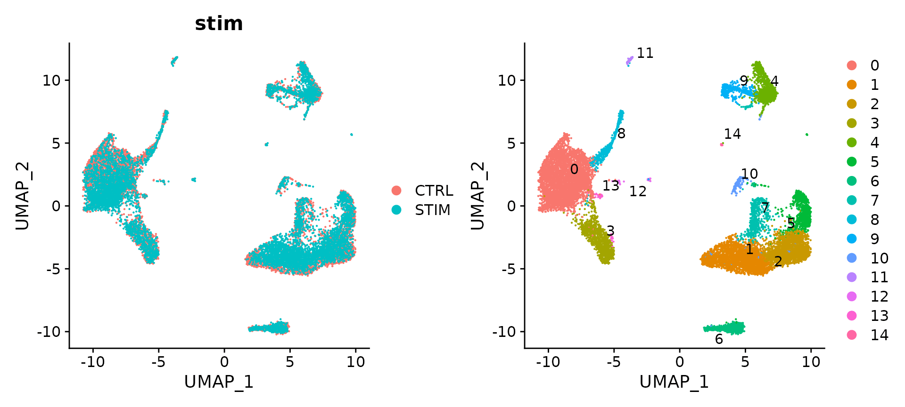


```R
DimPlot(immune.combined, reduction = "umap", split.by = "stim")
```


```R
# Identify conserved cell type markers
# For performing differential expression after integration, we switch back to the original
# data
DefaultAssay(immune.combined) <- "RNA"
nk.markers <- FindConservedMarkers(immune.combined, ident.1 = 6, grouping.var = "stim", verbose = FALSE)
head(nk.markers)

FeaturePlot(immune.combined, features = c("CD3D", "SELL", "CREM", "CD8A", "GNLY", "CD79A", "FCGR3A",
    "CCL2", "PPBP"), min.cutoff = "q9")
```

该步骤为了<mark>识别跨条件保守的典型细胞类型标记基因</mark>mark>，我们提供了该`FindConservedMarkers()`功能。此函数对每个数据集/组执行差异基因表达测试，并使用 MetaDE R 包中的元分析方法组合 p 值。例如，我们可以计算在簇 6（NK 细胞）中无论刺激条件如何都是保守标记的基因。

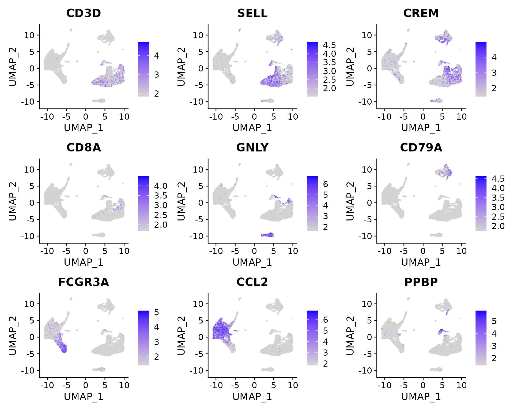

```R
immune.combined <- RenameIdents(immune.combined, `0` = "CD14 Mono", `1` = "CD4 Naive T", `2` = "CD4 Memory T",
    `3` = "CD16 Mono", `4` = "B", `5` = "CD8 T", `6` = "NK", `7` = "T activated", `8` = "DC", `9` = "B Activated",
    `10` = "Mk", `11` = "pDC", `12` = "Eryth", `13` = "Mono/Mk Doublets", `14` = "HSPC")
DimPlot(immune.combined, label = TRUE)
```

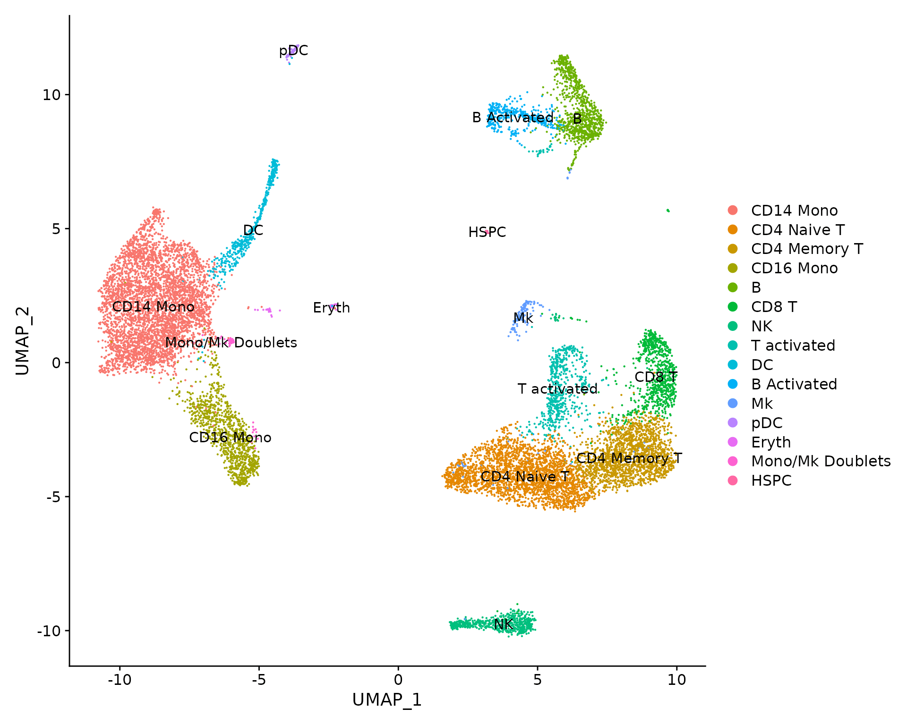

`DotPlot()`带有`split.by`参数的函数可用于查看跨条件的保守细胞类型标记，显示表达水平和表达任何给定基因的簇中细胞的百分比。在这里，我们为 14 个聚类中的每一个绘制了 2-3 个强标记基因。

```R
Idents(immune.combined) <- factor(Idents(immune.combined), levels = c("HSPC", "Mono/Mk Doublets",
    "pDC", "Eryth", "Mk", "DC", "CD14 Mono", "CD16 Mono", "B Activated", "B", "CD8 T", "NK", "T activated",
    "CD4 Naive T", "CD4 Memory T"))
markers.to.plot <- c("CD3D", "CREM", "HSPH1", "SELL", "GIMAP5", "CACYBP", "GNLY", "NKG7", "CCL5",
    "CD8A", "MS4A1", "CD79A", "MIR155HG", "NME1", "FCGR3A", "VMO1", "CCL2", "S100A9", "HLA-DQA1",
    "GPR183", "PPBP", "GNG11", "HBA2", "HBB", "TSPAN13", "IL3RA", "IGJ", "PRSS57")
DotPlot(immune.combined, features = markers.to.plot, cols = c("blue", "red"), dot.scale = 8, split.by = "stim") +
    RotatedAxis()
```


* 跨条件识别差异表达基因

现在我们已经对齐了受刺激和控制细胞，我们可以开始进行比较分析并查看刺激引起的差异。广泛观察这些变化的一种方法是绘制受刺激细胞和对照细胞的平均表达，并在散点图上寻找视觉异常值的基因。在这里，我们取受刺激和对照幼稚 T 细胞和 CD14 单核细胞群的平均表达，并生成散点图，突出显示对干扰素刺激有显着反应的基因。

```R
library(ggplot2)
library(cowplot)
theme_set(theme_cowplot())
t.cells <- subset(immune.combined, idents = "CD4 Naive T")
Idents(t.cells) <- "stim"
avg.t.cells <- as.data.frame(log1p(AverageExpression(t.cells, verbose = FALSE)$RNA))
avg.t.cells$gene <- rownames(avg.t.cells)

cd14.mono <- subset(immune.combined, idents = "CD14 Mono")
Idents(cd14.mono) <- "stim"
avg.cd14.mono <- as.data.frame(log1p(AverageExpression(cd14.mono, verbose = FALSE)$RNA))
avg.cd14.mono$gene <- rownames(avg.cd14.mono)

genes.to.label = c("ISG15", "LY6E", "IFI6", "ISG20", "MX1", "IFIT2", "IFIT1", "CXCL10", "CCL8")
p1 <- ggplot(avg.t.cells, aes(CTRL, STIM)) + geom_point() + ggtitle("CD4 Naive T Cells")
p1 <- LabelPoints(plot = p1, points = genes.to.label, repel = TRUE)
p2 <- ggplot(avg.cd14.mono, aes(CTRL, STIM)) + geom_point() + ggtitle("CD14 Monocytes")
p2 <- LabelPoints(plot = p2, points = genes.to.label, repel = TRUE)
p1 + p2
```

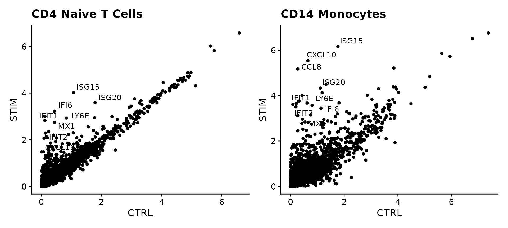

在不同条件下识别出常见的细胞类型，所以我们可以<mark>询问相同类型细胞在不同条件下哪些基因会发生变化</mark>。首先，我们在 meta.data 槽中创建一个列来保存细胞类型和刺激信息，并将当前标识切换到该列。然后我们`FindMarkers()`用来寻找刺激和对照 B 细胞之间不同的基因。请注意，此处显示的许多顶级基因与我们之前绘制的核心干扰素反应基因相同。此外，我们看到的 CXCL10 等特定于单核细胞和 B 细胞干扰素反应的基因在此列表中也显示出非常重要的意义。

```R
immune.combined$celltype.stim <- paste(Idents(immune.combined), immune.combined$stim, sep = "_")
immune.combined$celltype <- Idents(immune.combined)
Idents(immune.combined) <- "celltype.stim"
b.interferon.response <- FindMarkers(immune.combined, ident.1 = "B_STIM", ident.2 = "B_CTRL", verbose = FALSE)
head(b.interferon.response, n = 15)
```

可视化在基因表达的这些变化的另一种有用的方法是使用`split.by`选项给`FeaturePlot()`或`VlnPlot()`功能。这将显示给定基因列表的特征图，按分组变量（此处为刺激条件）拆分。CD3D 和 GNLY 等基因是典型的细胞类型标记（用于 T 细胞和 NK/CD8 T 细胞），它们几乎不受干扰素刺激的影响，并且在对照组和受刺激组中显示出相似的基因表达模式。另一方面，IFI6 和 ISG15 是核心干扰素反应基因，并在所有细胞类型中相应上调。最后，CD14 和 CXCL10 是显示细胞类型特异性干扰素反应的基因。刺激 CD14 单核细胞后 CD14 表达降低，这可能导致监督分析框架中的错误分类，强调了综合分析的价值。

```R
FeaturePlot(immune.combined, features = c("CD3D", "GNLY", "IFI6"), split.by = "stim", max.cutoff = 3,
    cols = c("grey", "red"))

plots <- VlnPlot(immune.combined, features = c("LYZ", "ISG15", "CXCL10"), split.by = "stim", group.by = "celltype",
    pt.size = 0, combine = FALSE)
wrap_plots(plots = plots, ncol = 1)
```


#### 使用 SCTransform 规范化的数据集执行整合

在[Hafemeister 和 Satija，2019 年](https://genomebiology.biomedcentral.com/articles/10.1186/s13059-019-1874-1)，介绍了一种基于正则化负二项式回归的改进的 scRNA-seq 标准化方法。该方法被命名为“sctransform”，并避免了标准规范化工作流程的一些缺陷，包括添加伪计数和对数转换。

有一些关键区别：

- 通过 单独规范化数据集`SCTransform()`，而不是`NormalizeData()`在集成之前
- 正如我们在[SCTransform 小插图中](https://satijalab.org/seurat/articles/sctransform_vignette.html)进一步讨论的[那样](https://satijalab.org/seurat/articles/sctransform_vignette.html)，我们通常使用 3,000 个或更多特征来分析 sctransform 的下游。
- `PrepSCTIntegration()`在识别锚点之前运行函数
- 运行`FindIntegrationAnchors()`时`IntegrateData()`，设置`normalization.method`参数为值`SCT`。
- 运行基于 sctransform 的工作流（包括集成）时，请勿运行该`ScaleData()`函数

```R
LoadData("ifnb")
ifnb.list <- SplitObject(ifnb, split.by = "stim")
ifnb.list <- lapply(X = ifnb.list, FUN = SCTransform)
features <- SelectIntegrationFeatures(object.list = ifnb.list, nfeatures = 3000)
ifnb.list <- PrepSCTIntegration(object.list = ifnb.list, anchor.features = features)
### 运行FindIntegrationAnchors()时IntegrateData()，设置normalization.method参数为值SCT。
immune.anchors <- FindIntegrationAnchors(object.list = ifnb.list, normalization.method = "SCT",
    anchor.features = features)
immune.combined.sct <- IntegrateData(anchorset = immune.anchors, normalization.method = "SCT")
immune.combined.sct <- RunPCA(immune.combined.sct, verbose = FALSE)
immune.combined.sct <- RunUMAP(immune.combined.sct, reduction = "pca", dims = 1:30)
p1 <- DimPlot(immune.combined.sct, reduction = "umap", group.by = "stim")
p2 <- DimPlot(immune.combined.sct, reduction = "umap", group.by = "seurat_annotations", label = TRUE,
    repel = TRUE)
p1 + p2
```


## 将 Seurat 与多模式数据一起使用

从同一个细胞同时测量多种数据类型的能力，称为多模态分析。首先，加载两个计数矩阵：一个用于 RNA 测量，一个用于抗体衍生标签 (ADT)。

1. 加载数据

```R
library(Seurat)
library(ggplot2)
library(patchwork)

# Load in the RNA UMI matrix

# Note that this dataset also contains ~5% of mouse cells, which we can use as negative
# controls for the protein measurements. For this reason, the gene expression matrix has
# HUMAN_ or MOUSE_ appended to the beginning of each gene.
cbmc.rna <- as.sparse(read.csv(file = "../data/GSE100866_CBMC_8K_13AB_10X-RNA_umi.csv.gz", sep = ",",
    header = TRUE, row.names = 1))

# To make life a bit easier going forward, we're going to discard all but the top 100 most
# highly expressed mouse genes, and remove the 'HUMAN_' from the CITE-seq prefix
cbmc.rna <- CollapseSpeciesExpressionMatrix(cbmc.rna)

# Load in the ADT UMI matrix
cbmc.adt <- as.sparse(read.csv(file = "../data/GSE100866_CBMC_8K_13AB_10X-ADT_umi.csv.gz", sep = ",",
    header = TRUE, row.names = 1))

# Note that since measurements were made in the same cells, the two matrices have identical column names
all.equal(colnames(cbmc.rna), colnames(cbmc.adt))
```

1. 设置 Seurat 对象，添加 RNA 和蛋白质数据

```R
# creates a Seurat object based on the scRNA-seq data
cbmc <- CreateSeuratObject(counts = cbmc.rna)

# We can see that by default, the cbmc object contains an assay storing RNA measurement
Assays(cbmc)

# create a new assay to store ADT information
adt_assay <- CreateAssayObject(counts = cbmc.adt)

# add this assay to the previously created Seurat object
cbmc[["ADT"]] <- adt_assay

# Validate that the object now contains multiple assays
Assays(cbmc)

# Switch the default to ADT(switch)
DefaultAssay(cbmc) <- "ADT"
DefaultAssay(cbmc)
```

1. 基于它们的 scRNA-seq 的数据对细胞进行聚类

```R
# Note that all operations below are performed on the RNA assay Set and verify that the
# default assay is RNA
DefaultAssay(cbmc) <- "RNA"
DefaultAssay(cbmc)

# perform visualization and clustering steps
cbmc <- NormalizeData(cbmc)
cbmc <- FindVariableFeatures(cbmc)
cbmc <- ScaleData(cbmc)
cbmc <- RunPCA(cbmc, verbose = FALSE)
cbmc <- FindNeighbors(cbmc, dims = 1:30)
cbmc <- FindClusters(cbmc, resolution = 0.8, verbose = FALSE)
cbmc <- RunUMAP(cbmc, dims = 1:30)
DimPlot(cbmc, label = TRUE)
```

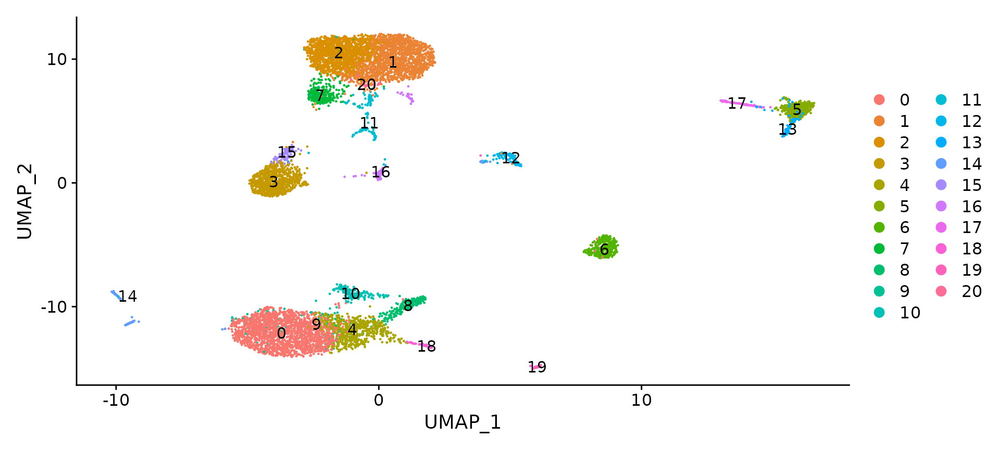

1. 并排显示多种模式的结果

```R
# Normalize ADT data,
DefaultAssay(cbmc) <- "ADT"
cbmc <- NormalizeData(cbmc, normalization.method = "CLR", margin = 2)
DefaultAssay(cbmc) <- "RNA"

# Note that the following command is an alternative but returns the same result
cbmc <- NormalizeData(cbmc, normalization.method = "CLR", margin = 2, assay = "ADT")

# Now, we will visualize CD14 levels for RNA and protein By setting the default assay, we can
# visualize one or the other
DefaultAssay(cbmc) <- "ADT"
p1 <- FeaturePlot(cbmc, "CD19", cols = c("lightgrey", "darkgreen")) + ggtitle("CD19 protein")
DefaultAssay(cbmc) <- "RNA"
p2 <- FeaturePlot(cbmc, "CD19") + ggtitle("CD19 RNA")

# place plots side-by-side
p1 | p2
```

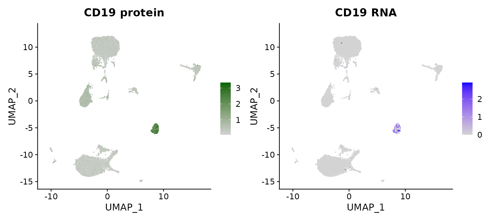

```R
# Alternately, we can use specific assay keys to specify a specific modality Identify the key
# for the RNA and protein assays
Key(cbmc[["RNA"]])
Key(cbmc[["ADT"]])
# Now, we can include the key in the feature name, which overrides the default assay
p1 <- FeaturePlot(cbmc, "adt_CD19", cols = c("lightgrey", "darkgreen")) + ggtitle("CD19 protein")
p2 <- FeaturePlot(cbmc, "rna_CD19") + ggtitle("CD19 RNA")
p1 | p2
```


1. 识别 scRNA-seq 簇的细胞表面标记

```R
# as we know that CD19 is a B cell marker, we can identify cluster 6 as expressing CD19 on the
# surface
VlnPlot(cbmc, "adt_CD19")
# we can also identify alternative protein and RNA markers for this cluster through
# differential expression
adt_markers <- FindMarkers(cbmc, ident.1 = 6, assay = "ADT")
rna_markers <- FindMarkers(cbmc, ident.1 = 6, assay = "RNA")
head(adt_markers)
```

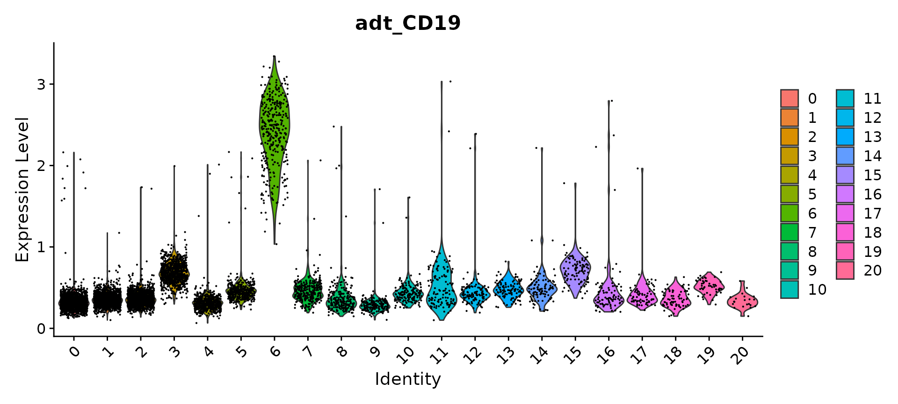

```R
# we can also identify alternative protein and RNA markers for this cluster through
# differential expression
adt_markers <- FindMarkers(cbmc, ident.1 = 6, assay = "ADT")
rna_markers <- FindMarkers(cbmc, ident.1 = 6, assay = "RNA")

head(adt_markers)
```

1. 多模式数据的其他可视化

```R
# Draw ADT scatter plots (like biaxial plots for FACS). Note that you can even 'gate' cells if
# desired by using HoverLocator and FeatureLocator
FeatureScatter(cbmc, feature1 = "adt_CD19", feature2 = "adt_CD3")
```

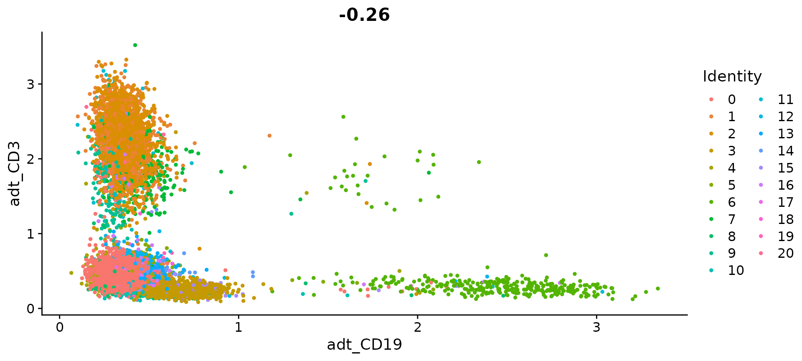

```R
# view relationship between protein and RNA
FeatureScatter(cbmc, feature1 = "adt_CD3", feature2 = "rna_CD3E")
```

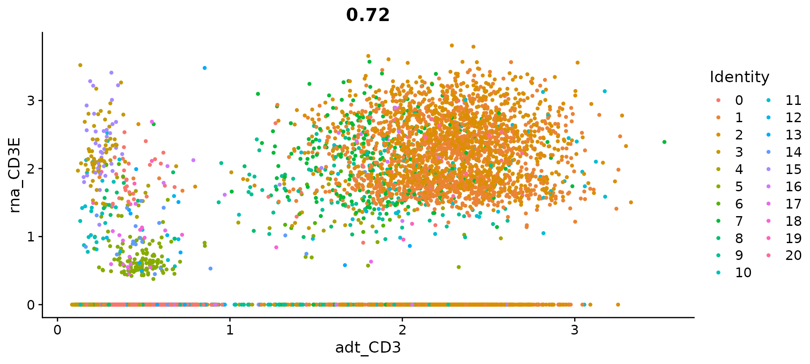

```R
FeatureScatter(cbmc, feature1 = "adt_CD4", feature2 = "adt_CD8")
```

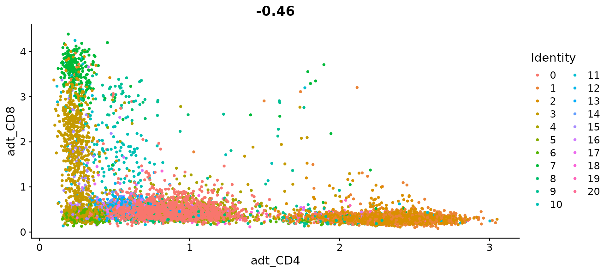

```R
# Let's look at the raw (non-normalized) ADT counts. You can see the values are quite high,
# particularly in comparison to RNA values. This is due to the significantly higher protein
# copy number in cells, which significantly reduces 'drop-out' in ADT data
FeatureScatter(cbmc, feature1 = "adt_CD4", feature2 = "adt_CD8", slot = "counts")
```

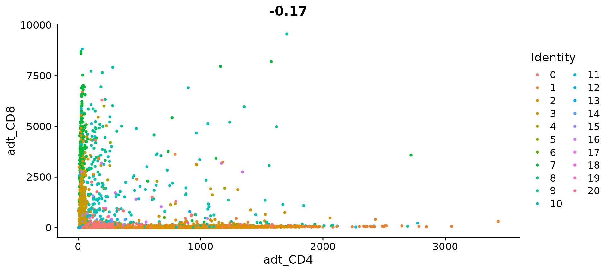

1. 从 10X 多模态实验中加载数据

Seurat 还能够分析来自使用 CellRanger v3 处理的多模式 10X 实验的数据；例如，我们使用 7,900 个外周血单个核细胞 (PBMC) 的数据集重新创建了上面的图。

```R
pbmc10k.data <- Read10X(data.dir = "../data/pbmc10k/filtered_feature_bc_matrix/")
rownames(x = pbmc10k.data[["Antibody Capture"]]) <- gsub(pattern = "_[control_]*TotalSeqB", replacement = "",
    x = rownames(x = pbmc10k.data[["Antibody Capture"]]))

pbmc10k <- CreateSeuratObject(counts = pbmc10k.data[["Gene Expression"]], min.cells = 3, min.features = 200)
pbmc10k <- NormalizeData(pbmc10k)
pbmc10k[["ADT"]] <- CreateAssayObject(pbmc10k.data[["Antibody Capture"]][, colnames(x = pbmc10k)])
pbmc10k <- NormalizeData(pbmc10k, assay = "ADT", normalization.method = "CLR")

plot1 <- FeatureScatter(pbmc10k, feature1 = "adt_CD19", feature2 = "adt_CD3", pt.size = 1)
plot2 <- FeatureScatter(pbmc10k, feature1 = "adt_CD4", feature2 = "adt_CD8a", pt.size = 1)
plot3 <- FeatureScatter(pbmc10k, feature1 = "adt_CD3", feature2 = "CD3E", pt.size = 1)
(plot1 + plot2 + plot3) & NoLegend()
```

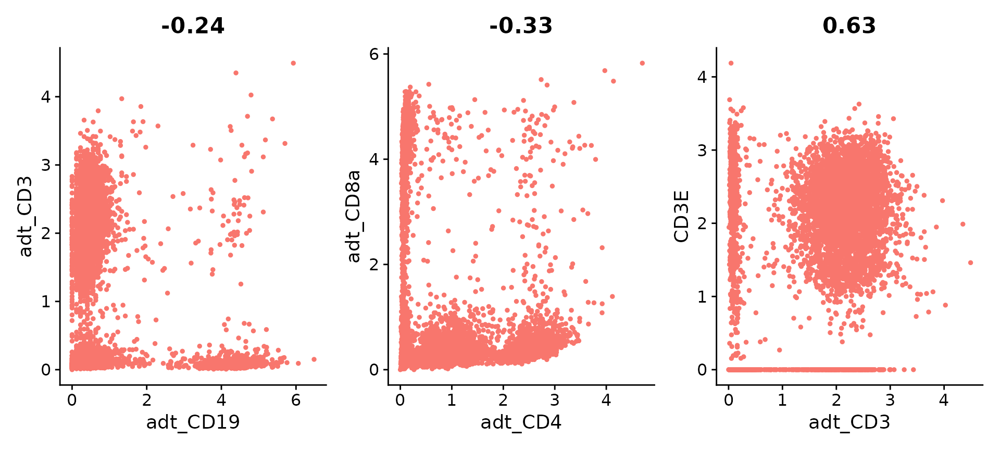

## 下游分析

### 细胞水平
#### 簇
##### 聚类分析
1. Seurat包

应用： scRNA-seq 数据、CyTOF 数据
* 这些方法将细胞嵌入到一个图结构中——例如一个 K-最近邻 (KNN) 图，在具有相似基因表达模式的单元之间绘制边，然后尝试将该图划分为高度互连的“准集团”或“群体”。
* 首先基于 PCA 空间中的欧几里德距离构建一个 KNN 图，并基于其局部邻域中的共享重叠（Jaccard 相似性）细化任意两个单元之间的边权重。此步骤使用该`FindNeighbors()`函数执行，并将先前定义的数据集维度（前 10 个 PC）作为输入。
* 为了对细胞进行聚类，我们接下来应用模块化优化技术，例如 Louvain 算法（默认）或 SLM ，以迭代方式将细胞分组在一起，目标是优化标准模块化函数. 该FindClusters()函数实现了这个过程，并包含一个分辨率参数，用于设置下游聚类的“分辨率（resolution）”，<mark>分辨率增加会得到更多的簇。我们发现，将这个参数设置在 0.4-1.2 之间通常会为大约 3K 细胞的单细胞数据集返回较好的聚类结果。</mark>对于较大的数据集，最佳分辨率通常会增加。可以使用该`Idents()`函数找到簇。
```r
pbmc <- FindNeighbors(pbmc, dims = 1:10)
pbmc <- FindClusters(pbmc, resolution = 0.5)
```
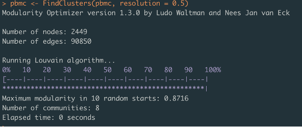
```r
# Look at cluster IDs of the first 5 cells
head(Idents(pbmc), 5)
```
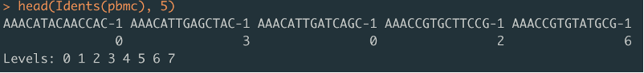

2. 通过伪时间表达模式聚类基因

在研究时间序列基因表达研究时出现的一个常见问题是：“哪些基因遵循相似的动力学趋势”？Monocle 可以通过对具有相似趋势的基因进行分组来帮助您回答这个问题，因此您可以分析这些组以查看它们的共同点。Monocle 提供了一种可视化所有伪时间依赖性基因的便捷方法。该函数`plot_pseudotime_heatmap`接受一个`CellDataSet`对象（通常只包含重要基因的一个子集）并生成平滑的表达曲线，就像`plot_genes_in_pseudotime`。然后，它对这些基因进行聚类并使用pheatmap包绘制它们，可以**可视化跨伪时间共变的基因模块**。
```r
diff_test_res <- differentialGeneTest(HSMM_myo[marker_genes,],
              fullModelFormulaStr = "~sm.ns(Pseudotime)")
sig_gene_names <- row.names(subset(diff_test_res, qval < 0.1))
plot_pseudotime_heatmap(HSMM_myo[sig_gene_names,],
                num_clusters = 3,
                cores = 1,
                show_rownames = T)
```
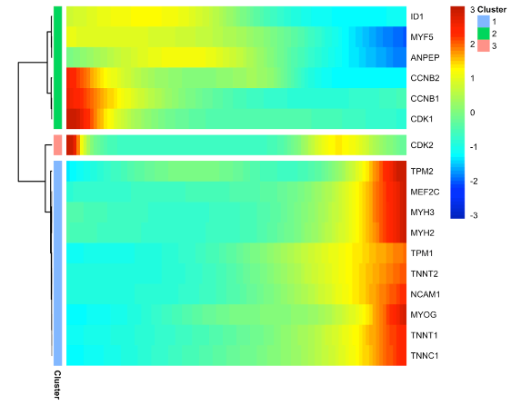


##### 对簇进行细胞类型注释
1. Seurat包
将无偏聚类与已知细胞类型匹配，并进行注释，<mark>属于先验知识进行注释，为无监督学习。</mark>
```r
new.cluster.ids <- c("Naive CD4 T", "CD14+ Mono", "Memory CD4 T", "B", "CD8 T", "FCGR3A+ Mono","NK", "DC", "Platelet")
names(new.cluster.ids) <- levels(pbmc)
pbmc <- RenameIdents(pbmc, new.cluster.ids)
DimPlot(pbmc, reduction = "umap", label = TRUE, pt.size = 0.5)+NoLegend()
saveRDS(pbmc, file = "../output/pbmc3k_final.rds")
```
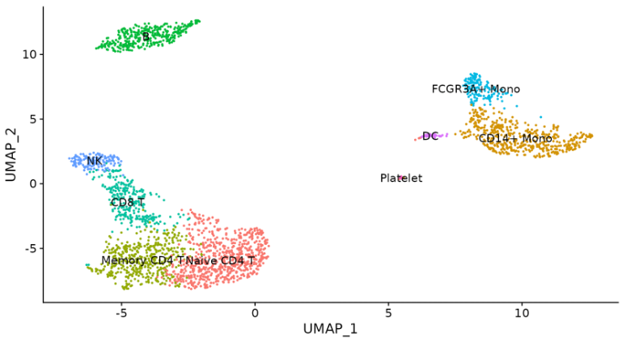
2. SingleR包
SingleR利用纯细胞类型的参考转录组数据集来独立推断每个单细胞的细胞可能类型。SingleR的注释与Seurat(一个为scRNA-seq设计的处理和分析包)相结合，为研究scRNA-seq数据提供了一个强大的工具。SingleR提供了内置的包装函数，可以用一个函数运行完整的流程。SingleR与Seurat交互较好，但是也可以使用任何其他scRNA-seq包，使用该包所有的数据集,网址如下。
<https://bioconductor.org/packages/release/data/experiment/vignettes/scRNAseq/inst/doc/scRNAseq.html#references>

原理：首先，计算参考数据集中每个样本的单细胞表达的spearman系数。相关分析仅对参考数据集中的可变基因（variable genes）进行。接着，根据参考数据集的命名注释聚合每个细胞类型的多个相关系数，从而为每个细胞类型提供一个值。接着SingleR将重新运行相关分析，但只针对上一步中的相关性较高的细胞类型。该分析仅对这些细胞类型之间的可变基因进行。移除最低值的细胞类型(或比最高值低0.05的边缘)，然后重复此步骤，直到只保留两种细胞类型。最后一次运行后，与顶部值对应的细胞类型被分配给单个细胞。
```r
# 根据需求选择上述网站的数据集作为SingleR的参考数据集
imm_ref <- DatabaseImmuneCellExpressionData()
# 进行细胞类型注释（一般选择第二种，可以直接注释Seurat聚类结果）
pred_single <- SingleR(test = pbmc@assays$SCT@data, 
                       ref = imm_ref, 
                       labels = imm_ref$label.main,
                       genes = "de",
                       de.method = "wilcox")

pred_cluster <- SingleR(test = pbmc@assays$SCT@data, 
                        ref = imm_ref, 
                        labels = imm_ref$label.main,
                        clusters = pbmc@meta.data$SCT_snn_res.0.6,
                        genes = "de",
                        de.method = "wilcox")

save(pred_single, file = "pred_single.rda")
save(pred_cluster, file = "pred_cluster.rda")

#
# plot
# 
x <- data.frame(seurat_celltype = Idents(pbmc),
                sr_single_first_ct = pred_single$first.labels,
                sr_single_ct = pred_single$labels,
                sr_single_pruned_ct = pred_single$pruned.labels,
                sr_cluster_first_ct = RenameCluster(pbmc@meta.data$SCT_snn_res.0.6, pred_cluster$first.labels),
                sr_cluster_ct = RenameCluster(pbmc@meta.data$SCT_snn_res.0.6, pred_cluster$labels),
                sr_cluster_pruned_ct = RenameCluster(pbmc@meta.data$SCT_snn_res.0.6, pred_cluster$pruned.labels),
                stringsAsFactors = TRUE)
pbmc@meta.data <- cbind(pbmc@meta.data, x, stringsAsFactors = TRUE)

plist = lapply(colnames(x), function(col){
  DimPlot(pbmc, reduction="umap", group.by = col, label = FALSE, pt.size = 1.5) +
    labs(title = col) + 
    scale_colour_d3("category20") + 
    rj.ftheme
})
ggsave("singer_compare_all.png", CombinePlots(plist, ncol = 3), width = 20, height = 15)

plist = lapply(colnames(x)[c(1,6,3)], function(col){
  DimPlot(pbmc, reduction="umap", group.by = col, label = FALSE, pt.size = 1.5) + labs(title = col) + scale_colour_d3("category20") + rj.ftheme
})
ggsave("singer_compare_ct.png", CombinePlots(plist, ncol = 3), width = 20, height = 5)


https://nbisweden.github.io/excelerate-scRNAseq/session-celltypeid/celltypeid.html

```


_______________

Update：SingleR包进行改版和更新 建议使用以下的代码。

```R
# Cell_typing
# SingleR细胞类型注释
  Seurat.data <- readRDS("Markers/Markers_0.5.rds")
# SCTransform()函数
  Seurat.data <- SCTransform(Seurat.data, vars.to.regress = "percent.mt")
# Load the SingleRdata  
  Seurat.data_for_SingleR <- GetAssayData(Seurat.data, slot="data")
  clusters=Seurat.data@meta.data$seurat_clusters
# 根据需求选择上述网站的数据集作为SingleR的参考数据集
  library(SingleR)
  library(scRNAseq)
  library(celldex)
#### Human being ####
#####################
## Using multiple references
  library(celldex)
  hpca <- HumanPrimaryCellAtlasData(ensembl=TRUE)
  bpe <- BlueprintEncodeData(ensembl=TRUE)

## annotation
  pred.human <- SingleR(test = Seurat.data_for_SingleR, assay.type.test=1,
                      ref = list(BPE=bpe, HPCA=hpca), 
                      labels = list(bpe$label.main, hpca$label.main))
  
## Check the final label from the combined assignment.
  table(pred.human$labels) 
  head(pred.human$orig.results$BPE$labels)
  head(pred.human$orig.results$HPCA$labels)

## visualization
  Seurat.data$hpca_type <- pred.human$orig.results$HPCA$labels
  Seurat.data$bpe_typ <- pred.human$orig.results$BPE$labels
  
## visualization
  library(ggsci)
  p1 <- DimPlot(Seurat.data, group.by='hpca_type',pt.size = 3)+scale_color_ucscgb()
  p2 <- DimPlot(Seurat.data, group.by='bpe_type',pt.size = 3)+scale_color_ucscgb()
  library(cowplot)
  p<-plot_grid(p1, p2, nrow=1, ncol=2, labels=panel.labels)
  ggsave("singler.pdf", plot = p, width = 15, height = 10) 
  
  
####### Mouse #######
#####################
  library(celldex)
  #immgen <- ImmGenData()
  immgen <- celldex::ImmGenData()
  mouseRNA <- celldex::MouseRNAseqData()
  monacoImm <- celldex::MonacoImmuneData()

## annotation
  pred.mouse <- SingleR(test = Seurat.data_for_SingleR, assay.type.test=1,
                        ref = list(Immgen=immgen, MouseRNA=mouseRNA,MonacoImmune=monacoImm), 
                        labels = list(immgen$label.main, mouseRNA$label.main,monacoImm$label.main))
  
## Check the final label from the combined assignment.
  table(pred.mouse$labels) 
  
## Check the 'winning' reference for each cell.
  table(pred.mouse$reference)   
  head(pred.mouse$orig.results$Immgen$labels)  
  head(pred.mouse$orig.results$MouseRNA$labels)
  head(pred.mouse$orig.results$MonacoImmune$labels)
    
## visualization
  Seurat.data$immgen <- pred.mouse$orig.results$Immgen$labels
  Seurat.data$MouseRNA <- pred.mouse$orig.results$MouseRNA$labels
  Seurat.data$MonacoImmun <- pred.mouse$orig.results$MonacoImmune$labels
  
  library(ggsci)
  p1 <- DimPlot(Seurat.data, group.by='immgen',pt.size = 3)+scale_color_ucscgb()
  p2 <- DimPlot(Seurat.data, group.by='MouseRNA',pt.size = 3)+scale_color_ucscgb()
  p3 <- DimPlot(Seurat.data, group.by='MonacoImmun',pt.size = 3)+scale_color_ucscgb()
  library(cowplot)
  p<-plot_grid(p1, p2,p3,nrow=1, ncol=3)
  ggsave("singler.pdf", plot = p, width = 15, height = 10)   
```

3. Garnett包
    （基于监督学习的从单细胞表达数据中实现自动细胞类型分类的软件包）

<font color=#FF0000>！！！

该包不再支持后面提到的monocle2包，目前只支持monocle3。</font>

原理：获取单细胞数据和细胞类型定义(marker)文件，并训练一个基于回归的分类器。一旦被训练成一个针对某一组织/样本类型的一个分类器，它就可以应用于从相似组织中对未来的数据集进行分类，其中分类器可以是下载现有的分类器或者训练自己的分类器。
```r
library(ggplot2)
library(ggsci)
library(Seurat)
library(dplyr)
library(tibble)
library(garnett)
library(monocle)
#
# 1. create monocle object from seurat
#
load("~/project/sc_standard_procedure/1_framework/Seurat/3.2.3_with_SCTransform/regress_nothing/pc10/pbmc.rda")
mat <- pbmc@assays$SCT@counts 
fdata <- data.frame(row.names = rownames(mat),
                    gene_short_name = rownames(mat),
                    stringsAsFactors = FALSE)
pdata <- data.frame(pbmc@meta.data,
                    pbmc@reductions$tsne@cell.embeddings,
                    stringsAsFactors = FALSE)
               
rownames(mat) <- rownames(fdata)
colnames(mat) <- rownames(pdata)

pd <- new("AnnotatedDataFrame", data = pdata)
fd <- new("AnnotatedDataFrame", data = fdata)
pbmc3k_cds <- newCellDataSet(as(mat, "dgCMatrix"),
                           phenoData = pd,
                           featureData = fd)
pbmc3k_cds <- estimateSizeFactors(pbmc3k_cds) # 归一化

#
# 2. choose classifier and  classify
# 
classifier <- readRDS("~/project/sc_standard_procedure/2_annotation/garnett/pre_trained_classifier/hsPBMC_20191017.RDS")

library(org.Hs.eg.db)
pbmc3k_cds <- classify_cells(pbmc3k_cds, classifier,
                           db = org.Hs.eg.db,
                           cluster_extend = TRUE,
                           cds_gene_id_type = "SYMBOL")

table(pData(pbmc3k_cds)$cell_type)
table(pData(pbmc3k_cds)$cluster_ext_type)

#
# 3. plot
# 
x <- data.frame(seurat_celltype = Idents(pbmc),
                garnett_cell_type = pData(pbmc3k_cds)$cell_type,
                garnett_cluster_ext_type = pData(pbmc3k_cds)$cluster_ext_type,
                stringsAsFactors = TRUE)
pbmc@meta.data <- cbind(pbmc@meta.data, x, stringsAsFactors = TRUE)

plist = lapply(colnames(x), function(col){
  DimPlot(pbmc, reduction="umap", group.by = col, label = FALSE, pt.size = 1.5) +
    labs(title = col) + 
    scale_colour_d3("category20") + 
    rj.ftheme
})

ggsave("garnett_compare_all_1.png", CombinePlots(plist, ncol = 3), width = 16, height = 4)
ggsave("garnett_compare_all_2.png", CombinePlots(plist, ncol = 3), width = 16, height = 4)

writeLines(capture.output(sessionInfo()), "sessionInfo.txt")
#----------------------------------------------------------------
#                                                               -
#                             test                              -
#                                                               -
#----------------------------------------------------------------

#
# 1 create monocle object
#
mat <- Matrix::readMM(system.file("extdata", "exprs_sparse.mtx", package = "garnett"))

fdata <- read.table(system.file("extdata", "fdata.txt", package = "garnett"))
pdata <- read.table(system.file("extdata", "pdata.txt", package = "garnett"), sep="\t")
row.names(mat) <- row.names(fdata)
colnames(mat) <- row.names(pdata)

pd <- new("AnnotatedDataFrame", data = pdata)
fd <- new("AnnotatedDataFrame", data = fdata)
pbmc_cds <- newCellDataSet(as(mat, "dgCMatrix"),
                           phenoData = pd,
                           featureData = fd)

pbmc_cds <- estimateSizeFactors(pbmc_cds)

#
# 2 check marker
#
library(org.Hs.eg.db)
marker_file_path <- system.file("extdata", "pbmc_bad_markers.txt",
                                package = "garnett")
marker_check <- check_markers(pbmc_cds, marker_file_path,
                              db=org.Hs.eg.db,
                              cds_gene_id_type = "SYMBOL",
                              marker_file_gene_id_type = "SYMBOL")

plot_markers(marker_check)

#
# 3 train classifier
#
library(org.Hs.eg.db)
set.seed(260)

marker_file_path <- system.file("extdata", "pbmc_test.txt",
                                package = "garnett")
pbmc_classifier <- train_cell_classifier(cds = pbmc_cds,
                                         marker_file = marker_file_path,
                                         db=org.Hs.eg.db,
                                         cds_gene_id_type = "SYMBOL",
                                         num_unknown = 50,
                                   marker_file_gene_id_type = "SYMBOL")

feature_genes <- get_feature_genes(pbmc_classifier,
                                   node = "root",
                                   db = org.Hs.eg.db)

get_classifier_references(pbmc_classifier)

#
# 4 classify your cells
#
library(org.Hs.eg.db)
pbmc_cds <- classify_cells(pbmc_cds, pbmc_classifier,
                           db = org.Hs.eg.db,
                           cluster_extend = TRUE,
                           cds_gene_id_type = "SYMBOL")

table(pData(pbmc_cds)$cell_type)
table(pData(pbmc_cds)$cluster_ext_type)

library(ggplot2)
pdf("result.pdf")
qplot(tsne_1, tsne_2, color = cell_type, data = pData(pbmc_cds)) + theme_bw()
qplot(tsne_1, tsne_2, color = cluster_ext_type, data = pData(pbmc_cds)) + theme_bw()
qplot(tsne_1, tsne_2, color = FACS_type, data = pData(pbmc_cds)) + theme_bw()
dev.off()
```
4. scibet包

原理：经过大量的统计分析和后续的实验验证，单细胞基因表达的count(比如UMI count)的分布可以用负二项分布很好的拟合,且相同细胞类型的单细胞表达谱服从同一个分布。因此将单细胞基因表达的count表示为泊松分布的伽马分布的混合分布，接着根据表达数据计算信息熵，挑出那些能表示不同簇细胞之间差异表达的基因，使用E-test以有监督和参数化的方式从训练集中选择细胞类型特异性基因，以去除嘈杂的基因以及通过压缩模型来加速下游分类，最后构建出基于监督学习的模型，从而对细胞类型进行注释。
```r
library(scibet)
library(celldex)
library(ggplot2)
library(ggsci)
library(Seurat)
library(dplyr)
library(tibble)
library(viridis)
#----------------------------------------------------------------
#                                                               -
#                             e-test                            -
#                                                               -
#----------------------------------------------------------------

load("~/project/sc_standard_procedure/1_framework/Seurat/3.2.3_with_SCTransform/regress_nothing/pc10/pbmc.rda")

expr <- as.data.frame(t(pbmc@assays$SCT@data))
expr$label <- Idents(pbmc)

etest_gene <- SelectGene(expr, k = 500, r = FALSE)
ggsave("marker_heatmap.png", Marker_heatmap(expr, etest_gene), width = 30, height = 6)

#----------------------------------------------------------------
#                                                               -
#                         training model                        -
#                                                               -
#----------------------------------------------------------------


num2 = 0
num1 = 0.5
while ( (num2/num1) < 0.92 ) {
  
  # traning 
  tibble(
    ID = 1:nrow(expr),
    label = expr$label
  ) %>%
    dplyr::sample_frac(0.7) %>%
    dplyr::pull(ID) -> ID
  
  train_set <- expr[ID,]      #construct reference set
  test_set <- expr[-ID,]      #construct query set
  
  prd <- SciBet(train_set, test_set[,-ncol(test_set)], k = 500)
  
  # check accuracy
  ori_label = test_set$label
  label = prd
  num1 <- length(ori_label)
  num2 <- tibble(
    ori = ori_label,
    prd = label
  ) %>%
    dplyr::filter(ori == prd) %>%
    nrow(.)
  
  print(num2/num1)
}

model = Learn(train_set)
export_model = ExportModel(model)
write.csv(t(export_model), file = "pbmc3k_export_model.csv")

# check model
ggsave("confusion_heatmap.png", Confusion_heatmap(as.character(test_set$label), prd), width = 8, height = 7)

#----------------------------------------------------------------
#                                                               -
#                           annotation                          -
#                                                               -
#----------------------------------------------------------------

load("~/project/sc_standard_procedure/1_preprocessing_clustering/Seurat/3.2.3_with_SCTransform/regress_nothing/pc10/pbmc.rda")

expr <- as.data.frame(t(pbmc@assays$SCT@data))
ori_label <- pbmc@meta.data$SCT_snn_res.0.6

# reference
ref_list <- c("./reference/major_human_cell_types.csv",
              "./reference/GSE84465_scibet_core.csv",
              "./reference/GSE109774_scibet_core.csv",
              "./50gene_training_model/50gene_pbmc3k_export_model.csv",
              "./500gene_training_model/500gene_pbmc3k_export_model.csv")

# predict
label <- sapply(ref_list, function(ref){
  
  # load traning model
  model = read.csv(ref)
  colnames(model) = toupper(colnames(model))
  model = pro.core(model)
  
  # predict
  prd = LoadModel(model)
  prd(expr)
  
})

label_df <- data.frame(label)
colnames(label_df) <- stringr::str_split_fixed(colnames(label_df),"\\.",5)[,4]

# plot
x <- data.frame(seurat_celltype = Idents(pbmc),
                label_df,
                stringsAsFactors = TRUE)
pbmc@meta.data <- cbind(pbmc@meta.data, x, stringsAsFactors = TRUE)

plist = lapply(colnames(x), function(col){
  DimPlot(pbmc, reduction="umap", group.by = col, label = FALSE, pt.size = 1.5) +
    labs(title = col) + 
    #scale_colour_d3("category20") + 
    rj.ftheme
})
ggsave("scibet_compare_all_1.png", CombinePlots(plist[-4], ncol = 2), width = 11, height = 11)
ggsave("scibet_compare_all_2.png", CombinePlots(plist[4], ncol = 3), width = 11, height = 5)

writeLines(capture.output(sessionInfo()), "sessionInfo.txt")
```

5. PanglaoDB

[PanglaoDB]: https://panglaodb.se/index.html


根据数据类型，选择所想要的marker参考基因集。

```r
celltype <- read.table('PanglaoDB_markers_27_Mar_2020.tsv',
                       sep = '\t',header = T,stringsAsFactors = F)

iHyperGD <- function(backGround,
                     geneNum.pathway,
                     geneNum.check,
                     geneNum.located){
  1-phyper(geneNum.located-1,
           geneNum.pathway,
           backGround - geneNum.pathway,
           geneNum.check,
           lower.tail = T)
}

hyperType <- function(genes,type,backGround){
  geneNum.pathway <- length(which(celltype$cell.type == type))
  geneNum.check   <- length(genes)
  geneNum.located <- sum(genes %in% celltype$official.gene.symbol[which(celltype$cell.type == type)])
  
  iHyperGD(backGround,geneNum.pathway,geneNum.check,geneNum.located)
}

cellTypeEst_hyper <- function(cluster,m,backGround = 2000,type = NA){
  genes <- m$gene[which(m$cluster == cluster)]
  
  p.val <- c()
  if(is.na(type)){
    for (Type in unique(celltype$cell.type)) {
      p.val <- c(p.val,hyperType(genes,Type,backGround))
    }
  }
  names(p.val) <- unique(celltype$cell.type)
  sort(p.val,decreasing = F)
}
# 一次一个分簇
cellTypeEst_hyper(2,m=pbmc.markers) 
for (i in (1:6)){
  print(cellTypeEst_hyper(i,m=pbmc.markers)[1])
}
```


#### 构建单细胞轨迹

主要使用Monocle2和Monocle3包。
> 伪时间分析

其功能基于单细胞转录组的表达矩阵，通过无监督学习（Reversed Graph Embedding算法）的方式将细胞置于发育轨迹的不同分支上，从而模拟细胞群体生物学过程。也就是我们经常说的拟时序（pseudotime）分析，又称细胞轨迹（cell trajectory）分析。通过拟时序分析可以推断出发育过程细胞的分化轨迹或细胞亚型的演化过程，主要基于关键基因的表达模式，通过学习每个细胞必须经历的基因表达变化的序列，根据拟时间值中对单个细胞进行排序，模拟出时间发育过程的动态变化。
<br> 
<b><mark>伪时间是衡量单个细胞通过细胞分化等过程取得多少进展的指标 </mark></b>Monocle 不是跟踪作为时间函数的表达变化，而是跟踪作为沿轨迹进展的函数的变化，我们称之为伪时间。伪时间是一个抽象的进程单位：它只是一个单元格和轨迹起点之间的距离，沿着最短路径测量。轨迹的总长度是根据细胞从起始状态移动到结束状态时所经历的转录变化总量来定义的。

>步骤

1. 导入数据，创建CellDataSet 类的对象
* 导入数据，创建CellDataSet 类的对象
```r
HSMM_expr_matrix <- read.table("fpkm_matrix.txt")
HSMM_sample_sheet <- read.delim("cell_sample_sheet.txt")
HSMM_gene_annotation <- read.delim("gene_annotations.txt")

pd <- new("AnnotatedDataFrame", data = HSMM_sample_sheet)
fd <- new("AnnotatedDataFrame", data = HSMM_gene_annotation)
HSMM <- newCellDataSet(as.matrix(HSMM_expr_matrix),
    phenoData = pd, featureData = fd)

rm(list=ls())
# 加载需要的R包
library(Seurat)
library(monocle)
# 设置cell ranger输出结果目录
input_dir <- "/Users/hecate/研一/blood_vessels_scRNA/matrix/BK-1111_matrix_10X"
# 读取数据
pbmc <- Read10X(input_dir)
pbmc <- CreateSeuratObject(pbmc, project = "pbmc10k", min.cells = 3, min.features = 200)

data <- as(as.matrix(pbmc@assays$RNA@data), 'sparseMatrix')

pd <- new('AnnotatedDataFrame', data = pbmc@meta.data)

fData <- data.frame(gene_short_name = row.names(data), row.names = row.names(data))
fd <- new('AnnotatedDataFrame', data = fData)

#Construct monocle cds
cds <- newCellDataSet(data,
                      phenoData = pd,
                      featureData = fd,
                      lowerDetectionLimit = 0.5,
                      expressionFamily = negbinomial.size())
```
<b>导入和导出Seurat或者scater包的数据<font color=#FF0000>（在做拟时序之前，最好先跑完seurat标准流程，并注释好细胞类型。）</b></font>
```r
HSMM_expr_matrix <- read.table("fpkm_matrix.txt")
HSMM_sample_sheet <- read.delim("cell_sample_sheet.txt")
HSMM_gene_annotation <- read.delim("gene_annotations.txt")

pd <- new("AnnotatedDataFrame", data = HSMM_sample_sheet)
fd <- new("AnnotatedDataFrame", data = HSMM_gene_annotation)
HSMM <- newCellDataSet(as.matrix(HSMM_expr_matrix),
    phenoData = pd, featureData = fd)
# 与Seurat，scater等R包的交互
## 导入 importCDS()
# Where 'data_to_be_imported' can either be a Seurat object
# or an SCESet.

importCDS(data_to_be_imported)

# We can set the parameter 'import_all' to TRUE if we'd like to
# import all the slots from our Seurat object or SCESet.
# (Default is FALSE or only keep minimal dataset)

importCDS(data_to_be_imported, import_all = TRUE)

## 导出 exportCDS()
# To convert to Seurat object
lung_seurat <- exportCDS(lung, 'Seurat')

# To convert to SCESet
lung_SCESet <- exportCDS(lung, 'Scater')
```

* 选择数据的分布类型❗❗❗️
Monocle 适用于相对表达数据和基于计数的测量（例如 UMI）。一般来说，它最适用于转录本计数数据，尤其是 UMI 数据。<font color=#FF0000>FPKM/TPM 值通常呈对数正态分布，而 UMI 或读取计数更适合使用负二项式分布建模。</font>
```r
HSMM <- newCellDataSet(count_matrix,
                phenoData = pd,
                featureData = fd,
                expressionFamily=negbinomial.size())
```
<table>
<tr><td>negbinomial.size()</td><td>UMI、来自掺入实验的转录本计数或relative2abs()原始读取计数</td></tr>
<tr><td>negbinomial()</td><td>UMI、来自掺入实验的转录本计数或relative2abs原始读取计数</td></tr>
<tr><td>tobit()</td><td>FPKM、TPM</td></tr>
<tr><td>gaussianff()</td><td>对数转换的 FPKM/TPM，来自单细胞 qPCR 的 Ct 值</td></tr>
</table>

* 使用大型数据集（推荐）
使用*稀疏矩阵*可以帮助您在典型计算机上处理大量数据集。我们通常建议大多数用户使用 sparseMatrices，因为它可以加速许多计算，即使对于较小规模的数据集也是如此。
```r
HSMM <- newCellDataSet(as(umi_matrix, "sparseMatrix"),
                phenoData = pd,
                featureData = fd,
                lowerDetectionLimit = 0.5,
                expressionFamily = negbinomial.size())
```
❗❗❗️许多 RNA-Seq 流程（包括 CellRanger）的输出已经是稀疏矩阵格式（例如 MTX）。这时直接将其传递给newCellDataSet，而无需先将其转换为密集矩阵（通过as.matrix()，因为这可能会超出可用内存。
<br>如果使用的是<font color=#0000FF>10X Genomics 数据并且正在使用cellrangerRkit，使用下列代码进行加载该数据。</font>
```r
cellranger_pipestance_path <- "/path/to/your/pipeline/output/directory"
gbm <- load_cellranger_matrix(cellranger_pipestance_path)

fd <- fData(gbm)

# The number 2 is picked arbitrarily in the line below.
# Where "2" is placed you should place the column number that corresponds to your
# featureData's gene short names.

colnames(fd)[2] <- "gene_short_name"

gbm_cds <- newCellDataSet(exprs(gbm),
                  phenoData = new("AnnotatedDataFrame", data = pData(gbm)),
                  featureData = new("AnnotatedDataFrame", data = fd),
                  lowerDetectionLimit = 0.5,
                  expressionFamily = negbinomial.size())
```
*  🔺估计尺寸因子和分散<font color=#FF0000>（需要）</font>
<br>尺寸因子帮助我们对跨细胞恢复的 mRNA 差异进行标准化。
<br>“分散”值将帮助我们稍后进行差异表达分析。
<br><b>要求：</b>
`stimateSizeFactors()`和`estimateDispersions()`仅在使用带有`negbinomial()``ornegbinomial.size()`的 `CellDataSet` 时才有效。
```r
HSMM <- estimateSizeFactors(HSMM)
HSMM <- estimateDispersions(HSMM)
```
* 过滤低质量细胞（推荐）
```r
# 查看细胞中 mRNA 总数的分布
pData(HSMM)$Total_mRNAs <- Matrix::colSums(exprs(HSMM))

HSMM <- HSMM[,pData(HSMM)$Total_mRNAs < 1e6]

upper_bound <- 10^(mean(log10(pData(HSMM)$Total_mRNAs)) +
            2*sd(log10(pData(HSMM)$Total_mRNAs)))
lower_bound <- 10^(mean(log10(pData(HSMM)$Total_mRNAs)) -
            2*sd(log10(pData(HSMM)$Total_mRNAs)))

qplot(Total_mRNAs, data = pData(HSMM), color = Hours, geom =
"density") +
geom_vline(xintercept = lower_bound) +
geom_vline(xintercept = upper_bound)
```
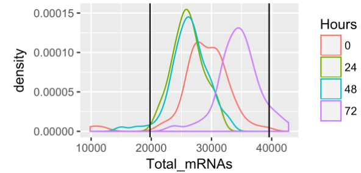
```r
HSMM <- HSMM[,pData(HSMM)$Total_mRNAs > lower_bound &
      pData(HSMM)$Total_mRNAs < upper_bound]
HSMM <- detectGenes(HSMM, min_expr = 0.1) #计算每个基因在多少细胞中表达

# 验证CellDataSet 是否遵循大致对数正态分布
# Log-transform each value in the expression matrix.
L <- log(exprs(HSMM[expressed_genes,]))

# Standardize each gene, so that they are all on the same scale,
# Then melt the data with plyr so we can plot it easily
melted_dens_df <- melt(Matrix::t(scale(Matrix::t(L))))

# Plot the distribution of the standardized gene expression values.
qplot(value, geom = "density", data = melted_dens_df) +
stat_function(fun = dnorm, size = 0.5, color = 'red') +
xlab("Standardized log(FPKM)") +
ylab("Density")
```
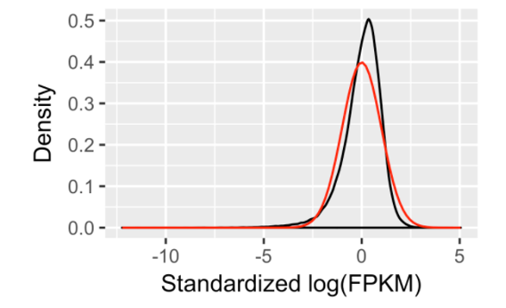

2. 聚类和细胞类型注释（一般推荐使用Seurat的标准流程）
* <b>Step1: 选择定义细胞进程的基因（特征选择）</b>
```r
# 选择的基因随着我们正在研究的过程的进展而增加（或减少）表达（差异表达的基因）
## 分离一组排序基因的一种有效方法是简单地将过程开始时收集的细胞与过程结束时收集的细胞进行比较，并找到差异表达的基因
diff_test_res <- differentialGeneTest(HSMM_myo[expressed_genes,],
              fullModelFormulaStr = "~Media")
ordering_genes <- row.names (subset(diff_test_res, qval < 0.01))
# 无时间序列数据时
HSMM_myo <- setOrderingFilter(HSMM_myo, ordering_genes)
plot_ordering_genes(HSMM_myo)
```
* <b>Step2:降低数据维度</b> 
<br>DDRTree: 将高维空间的数据点降至二维，方便可视化
```r
HSMM_myo <- reduceDimension(HSMM_myo, max_components = 2,
    method = 'DDRTree')
```
❗❗❗️Monocle3使用的降维方法为UMAP和tSNE

* <b>Step3: 沿轨迹对细胞进行排序</b>
<br>轨迹具有树状结构。我们可以看到，在时间零收集的细胞位于树尖之一附近，而其他细胞分布在两个“树枝”之间。Monocle 不知道先验地 将树的哪个轨迹称为“开始”，因此对`orderCells`使用`root_state`参数再次调用以指定开始。

```r
HSMM_myo <- orderCells(HSMM_myo)
## ❗️设定根结点，需要根据后续的图来进一步确定最佳的根结点
mycds <- orderCells(mycds, root_state = 2)
## 结果可视化
## Hours轨迹分布图
plot_cell_trajectory(HSMM_myo, color_by = "Hours")
```
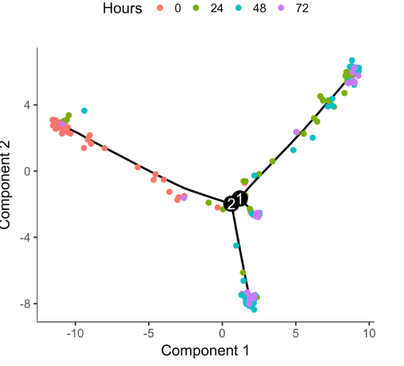
```r
# 在时间零收集的细胞位于树尖之一附近，而其他细胞分布在两个“树枝”之间。Monocle 不知道先验地将树的哪个轨迹称为“开始”，因此我们需要再次调参以指定开始。
# 通过“state”为细胞着色
plot_cell_trajectory(HSMM_myo, color_by = "State")
```
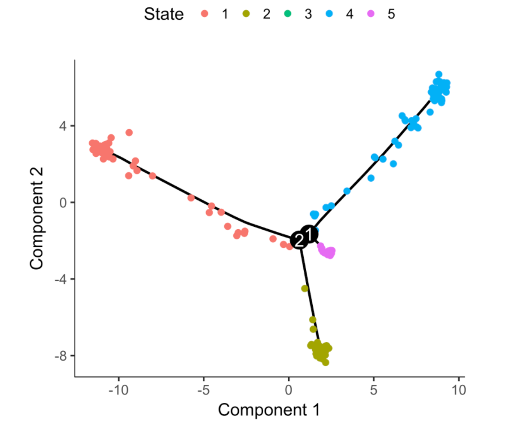
```r
# 通过识别包含从时间零开始的大部分细胞的状态
GM_state <- function(cds){
  if (length(unique(pData(cds)$State)) > 1){
    T0_counts <- table(pData(cds)$State, pData(cds)$Hours)[,"0"]
    return(as.numeric(names(T0_counts)[which
          (T0_counts == max(T0_counts))]))
  } else {
    return (1)
  }
}
##Pseudotime轨迹图
HSMM_myo <- orderCells(HSMM_myo, root_state = GM_state(HSMM_myo))
plot_cell_trajectory(HSMM_myo, color_by = "Pseudotime")
```
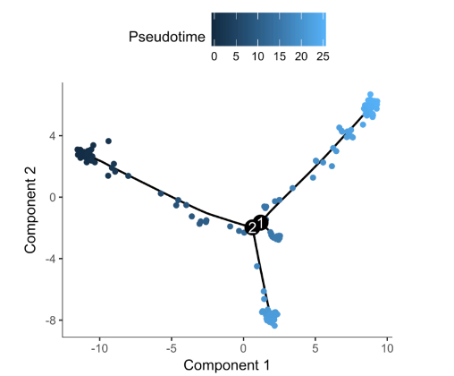
```r
# “分面”轨迹图
plot_cell_trajectory(HSMM_myo, color_by = "State") +
    facet_wrap(~State, nrow = 1)
```
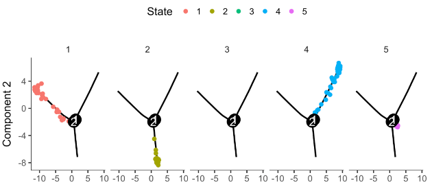
```r
# 无时间序列，需先验知识，根据某些标记基因的表达位置来设置根
blast_genes <- row.names(subset(fData(HSMM_myo),
gene_short_name %in% c("CCNB2", "MYOD1", "MYOG")))
plot_genes_jitter(HSMM_myo[blast_genes,],
    grouping = "State",
min_expr = 0.1)
```
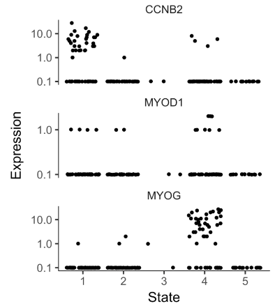
```r
# 为了确认排序是正确的，绘制选择的基因的表达水平
HSMM_expressed_genes <-  row.names(subset(fData(HSMM_myo),
num_cells_expressed >= 10))
HSMM_filtered <- HSMM_myo[HSMM_expressed_genes,]
my_genes <- row.names(subset(fData(HSMM_filtered),
          gene_short_name %in% c("CDK1", "MEF2C", "MYH3")))
cds_subset <- HSMM_filtered[my_genes,]
plot_genes_in_pseudotime(cds_subset, color_by = "Hours")
```
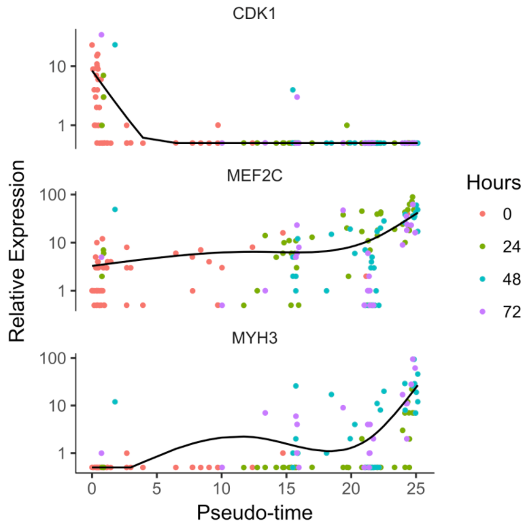

<b>补充：</b>可以通过选择发育差异表达基因，选择clusters差异表达基因，选择离散程度高的基因。自定义发育marker基因来选择基因，前三个为无监督方法，最后一个为半监督分析，需要先验知识。
```r
##使用seurat选择的高变基因⚠️
express_genes <- VariableFeatures(pbmc)
cds <- setOrderingFilter(cds, express_genes)
plot_ordering_genes(cds)
##使用clusters差异表达marker基因
deg.cluster <- FindAllMarkers(pbmc)
express_genes <- subset(deg.cluster,p_val_adj<0.05)$gene
cds <- setOrderingFilter(cds, express_genes)
plot_ordering_genes(cds)
##使用monocle选择的高变基因⚠️
disp_table <- dispersionTable(cds)
disp.genes <- subset(disp_table, mean_expression >= 0.1 & dispersion_empirical >= 1 * dispersion_fit)$gene_id
cds <- setOrderingFilter(cds, disp.genes)
plot_ordering_genes(cds)
```
> Monocle3
其中，Monocle3与Monocle2的区别在于：
* 从UMAP图识别发育轨迹，可以继承Seurat的质控、批次校正和降维分析结果，实现“一张图”展现细胞的聚类、鉴定和轨迹分析结果。
* 自动对UMAP图分区（partition），可以选择多个起点，轨迹分析算法的逻辑更符合生物学现实。
* 将拟合一个主图在每个分区内使用learn_graph()函数，为了将细胞排列整齐，我们通过选择我们标记为轨迹“根”的图形区域来确定生物过程的“开始”在哪里。

```r
library(monocle3)
library(Seurat)
library(ggplot2)
library(ggsci)

#
# 1. create
#
# pbmc.data <- Read10X(data.dir = "~/project/10x_sc/data/pbmc3k/filtered_gene_bc_matrices_h19")
pbmc.data <- Read10X(data.dir = "~/filtered_gene_bc_matrices_h19")
satija <- readRDS(file = "/home/renjun/filtered_gene_bc_matrices_h19/pbmc3k_final.rds")

expr_matrix <- as.matrix(pbmc.data)
sample_sheet <- data.frame(row.names = colnames(pbmc.data),
                           id = colnames(pbmc.data),
                           stringsAsFactors = FALSE)
gene_annotation <- data.frame(row.names = rownames(pbmc.data),
                              id = rownames(pbmc.data),
                              gene_short_name = rownames(pbmc.data),
                              stringsAsFactors = FALSE)
cds <- new_cell_data_set(expr_matrix,
                         cell_metadata = sample_sheet,
                         gene_metadata = gene_annotation)
# cds <- load_mm_data(mat_path = "~/filtered_gene_bc_matrices_h19/matrix.mtx", 
#                     feature_anno_path = "~/filtered_gene_bc_matrices_h19/genes.tsv", 
#                     cell_anno_path = "~/filtered_gene_bc_matrices_h19/barcodes.tsv")

#
# 2. preprocessing
#
cds <- preprocess_cds(cds, num_dim = 50, norm_method = "log", scaling = TRUE)
ggsave("pv_variance.png", plot_pc_variance_explained(cds), width = 5, height = 5)

#
# 3. reduce dimension
#
cds <- reduce_dimension(cds, max_components = 2, reduction_method = "UMAP", preprocess_method = "PCA")
cds <- reduce_dimension(cds, max_components = 2, reduction_method = "tSNE", preprocess_method = "PCA")
# cds <- align_cds(cds, alignment_group = "batch", residual_model_formula_str = "~ bg.300.loading + bg.400.loading")
# marker <- c("MS4A1", "GNLY", "CD3E", "CD14", "FCER1A", "FCGR3A", 
#            "LYZ", "PPBP", "CD8A","IL7R","CCR7","S100A4")

#
# 4. clustering
#
cds <- cluster_cells(cds, reduction_method = "UMAP", k = 20, cluster_method = "leiden", resolution = 1e-4) #default
cds <- cluster_cells(cds, reduction_method = "tSNE", k = 20, cluster_method = "leiden", resolution = 1e-2)
cds <- cluster_cells(cds, reduction_method = "PCA", k = 20, cluster_method = "louvain")
# cds@clusters@listData$PCA$clusters

# plot cell with cluster
p1 <- plot_cells(cds, reduction_method = "UMAP", color_cells_by = "cluster", 
                 cell_size = 2.3, alpha = 0.5, group_label_size = 5) + 
  scale_colour_d3("category20") +  rj.ftheme
p2 <- plot_cells(cds, reduction_method = "tSNE", color_cells_by = "cluster", 
                 cell_size = 2.3, alpha = 0.5, group_label_size = 5) + 
  scale_colour_d3("category20") +  rj.ftheme
p3 <- plot_cells(cds, reduction_method = "PCA", color_cells_by = "cluster", 
                 cell_size = 2.3, alpha = 0.5, group_label_size = 5) + 
  scale_colour_d3("category20") +  rj.ftheme

ggsave("2d_cluster.png", CombinePlots(list(p1,p2,p3), ncol = 3), width = 12, height = 4)

# plot cell with partition
p1 <- plot_cells(cds, reduction_method = "UMAP", color_cells_by = "partition", 
                 cell_size = 2.3, alpha = 0.5, group_label_size = 5) + 
  scale_colour_d3("category20") +  rj.ftheme
p2 <- plot_cells(cds, reduction_method = "tSNE", color_cells_by = "partition", 
                 cell_size = 2.3, alpha = 0.5, group_label_size = 5) + 
  scale_colour_d3("category20") +  rj.ftheme
p3 <- plot_cells(cds, reduction_method = "PCA", color_cells_by = "partition", 
                 cell_size = 2.3, alpha = 0.5, group_label_size = 5) + 
  scale_colour_d3("category20") +  rj.ftheme

ggsave("2d_partition.png", CombinePlots(list(p1,p2,p3), ncol = 3), width = 12, height = 4)

#
# 5. find marker
#
marker_test_res <- top_markers(cds, group_cells_by = "cluster", reduction_method = "UMAP", reference_cells = 1000, cores = 1)

top_specific_markers <- marker_test_res %>%
  filter(fraction_expressing >= 0.10) %>%
  group_by(cell_group) %>%
  top_n(10, pseudo_R2)

top_specific_marker_ids <- unique(top_specific_markers %>% pull(gene_id))

p <- plot_genes_by_group(cds,
                         top_specific_marker_ids,
                         group_cells_by = "cluster",
                         reduction_method = "UMAP",
                         ordering_type = "maximal_on_diag",
                         max.size = 3)
ggsave("top_gene10_heatmap.png", p, width = 6, height = 8)

#
# 6. choose cells for a subset
#
cds_subset <- choose_cells(cds)

#
# 7. learn the trajectory
#
cds <- learn_graph(cds)

# Passing the programatically selected root node to order_cells() via the root_pr_nodeargument yields:
cds <- order_cells(cds)
p <- plot_cells(cds,
                color_cells_by = "pseudotime",
                reduction_method = "UMAP",
                label_groups_by_cluster=FALSE,
                label_leaves=TRUE,
                label_branch_points=FALSE) + rj.ftheme
ggsave("pseudotime2.png", p, width = 6, height = 6)

save(cds, file = "cds.rda")
```
### 基因水平
#### 基因的差异表达分析
[❗️❗️❗️该步骤一般在聚类分析之后，细胞类型注释之前进行]

##### 寻找差异表达的特征基因（簇生物标志物）
> Seurat包

1. 运行非线性降维❗️❗️❗️

Seurat提供几个非线性降维方法，如tSNE和UMAP，来可视化和探索这些数据集。这些算法的目标是学习数据的底层流形，以便将相似的细胞放在低维空间中。上面确定的基于图形的簇中的细胞应该共同定位在这些降维图中。作为 UMAP 和 tSNE 的输入，我们建议使用相同的 PC 作为聚类分析的输入。由于t-SNE所使用的时间较长，一般使用UMAP。
```r
# If you haven't installed UMAP, you can do so via reticulate::py_install(packages =
# 'umap-learn')
pbmc <- RunUMAP(pbmc, dims = 1:10)
# note that you can set `label = TRUE` or use the LabelClusters function to help label
# individual clusters
DimPlot(pbmc, reduction = "umap")
# save the data
saveRDS(pbmc, file = "../output/pbmc_tutorial.rds")
```
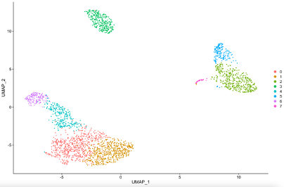
2. marker基因的识别
<br>找到通过差异表达定义聚类的标记基因。默认情况下，`ident.1`与所有其他细胞相比，它识别单个簇（在`ident.1`中指定）的阳性和阴性标记。`FindAllMarkers()`为所有簇自动执行此过程，但也可以测试簇与簇之间的对比，或针对所有细胞进行测试。
<br>该`min.pct`参数要求在两组细胞中的任何一组中以最小百分比检测到一个基因，而 `thresh.test`参数要求一个基因在两组之间差异表达（平均）一定量。可以将这两个都设置为 0，但时间会显着增加，因为这将测试大量不太可能具有高度歧视性的基因。作为加速这些计算的另一个选项，`max.cells.per.ident`可以设置。
<br>Seurat 有几种差异表达测试，可以使用 test.use 参数进行设置，接着可视化。
<br>目前支持以下差异表达测试：
<table>
   <tr>
      <td>“wilcox”：Wilcoxon 秩和检验（默认）</td>
   </tr>
   <tr>
      <td>“bimod”：单细胞特征表达的似然比检验【默认】</td>
   </tr>
   <tr>
      <td>“roc”：标准 AUC 分类器</td>
   </tr>
   <tr>
      <td>“t”：学生的 t 检验</td>
   </tr>
   <tr>
      <td>“泊松”：假设潜在负二项式分布的似然比检验。仅用于基于 UMI 的数据集</td>
   </tr>
   <tr>
      <td>“negbinom”：假设潜在负二项式分布的似然比检验。仅用于基于 UMI 的数据集</td>
   </tr>
   <tr>
      <td>“LR”：使用逻辑回归框架来确定差异表达的基因。构建逻辑回归模型，分别基于每个特征预测组成员身份，并将其与具有似然比检验的空模型进行比较。</td>
   </tr>
   <tr>
      <td>“MAST”：将细胞检测率视为协变量的 GLM 框架</td>
   </tr>
   <tr>
      <td>“DESeq2”：DE 基于使用负二项分布的模型</td>
   </tr>
   <tr>
      <td></td>
   </tr>
</table>

```r
# find all markers of cluster 2
cluster2.markers <- FindMarkers(pbmc, ident.1 = 2, min.pct = 0.25)
head(cluster2.markers, n = 5)
# find all markers distinguishing cluster 5 from clusters 0 and 3
cluster5.markers <- FindMarkers(pbmc, ident.1 = 5, ident.2 = c(0, 3), min.pct = 0.25)
head(cluster5.markers, n = 5)
# find markers for every cluster compared to all remaining cells, report only the positive ones
pbmc.markers <- FindAllMarkers(pbmc, only.pos = TRUE, min.pct = 0.25, logfc.threshold = 0.25)
pbmc.markers %>%
    group_by(cluster) %>%
    slice_max(n = 2, order_by = avg_log2FC)
VlnPlot(pbmc, features = c("MS4A1", "CD79A"))
```
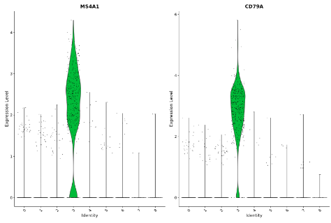
```r
# you can plot raw counts as well
VlnPlot(pbmc, features = c("NKG7", "PF4"), slot = "counts", log = TRUE)
```
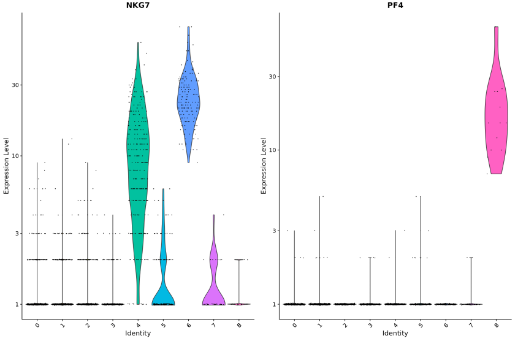
```r
FeaturePlot(pbmc, features = c("MS4A1", "GNLY", "CD3E", "CD14", "FCER1A", "FCGR3A", "LYZ", "PPBP","CD8A"))
```
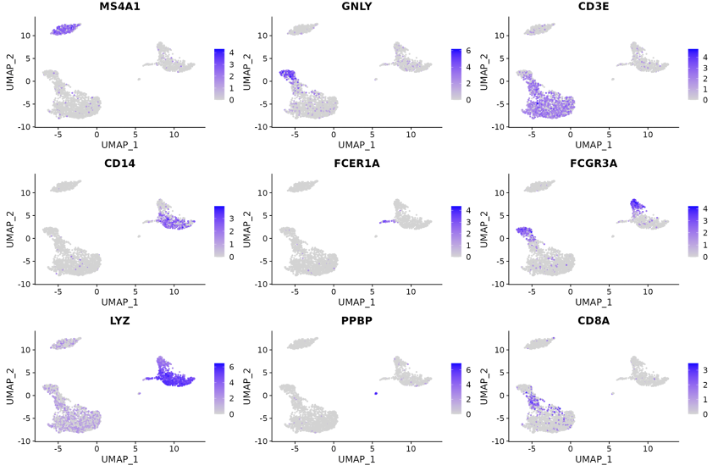
```r
# DoHeatmap()为给定的细胞和特征生成一个表达热图。在这种情况下，我们为每个簇绘制前 20 个标记（或所有标记，如果小于 20）。
pbmc.markers %>% group_by(cluster) %>%top_n(n = 10, wt = avg_log2FC) -> top10
DoHeatmap(pbmc, features = top10$gene) + NoLegend()
```
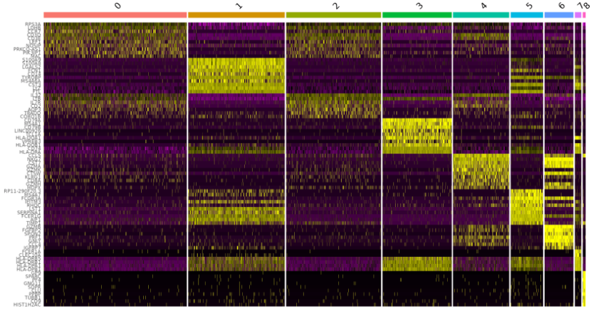

##### 与伪时间分析相关的差异表达分析 
> Monocle2包
1. 寻找随伪时间变化的基因

Monocle 的主要工作是在不知道提前查看哪些基因的情况下，将细胞按生物过程（例如细胞分化）的进展顺序排列。可以分析细胞以找到随着细胞进展而发生变化的基因。
```r
to_be_tested <- row.names(subset(fData(HSMM),
gene_short_name %in% c("MYH3", "MEF2C", "CCNB2", "TNNT1")))
cds_subset <- HSMM_myo[to_be_tested,]
# Monocle 使用VGAM包将基因的表达水平建模为伪时间的平滑非线性函数
diff_test_res <- differentialGeneTest(cds_subset,
fullModelFormulaStr = "~sm.ns(Pseudotime)")
diff_test_res[,c("gene_short_name", "pval", "qval")]
plot_genes_in_pseudotime(cds_subset, color_by = "Hours")
```


2. 分析单细胞轨迹中的分支
<br>单细胞轨迹包括分支。分支的出现是因为细胞执行替代基因表达程序。分支出现在发育过程中的轨迹中，当细胞做出命运选择时：一个发育谱系沿着一条路径前进，而另一个谱系产生第二条路径。Monocle采用分支表达式分析建模，主要是BEAM(Branched expression analysis modeling)函数，可以将分叉过程重构为一个分支轨迹，比较分枝点与分枝末端的差异，从而分析不同细胞命运下的差异。<mark>Monocle可以模拟出每个细胞所处的分化时间，并寻找随着分化时间逐渐升高或降低的基因表达热图和分布图。</mark>
```r
# BEAM将已排序的CellDataSetorderCells和轨迹中分支点的名称作为输入。它返回每个基因的显着性分数表。得分显着的基因在其表达中被认为是分支依赖性的。
BEAM_res <- BEAM(lung, branch_point = 1, cores = 1)
BEAM_res <- BEAM_res[order(BEAM_res$qval),]
BEAM_res <- BEAM_res[,c("gene_short_name", "pval", "qval")]
# 可以使用特殊类型的热图可视化所有显着依赖于分支的基因的变化。此热图同时显示了两个谱系的变化。它还要求选择要检查的分支点。列是伪时间中的点，行是基因，伪时间的开始位于热图的中间。branch_point=1，分支点选为1，分析branch_point = 1这个分支处的细胞命名分叉是如何进行的。num_clusters=4，将基因根据表达相似性分成4个模块。

plot_genes_branched_heatmap(lung[row.names(subset(BEAM_res,
                                          qval < 1e-4)),],
                                          branch_point = 1,
                                          num_clusters = 4,
                                          cores = 1,
                                          use_gene_short_name = T,
                                          show_rownames = T)
                                          # 可视化所想要研究的基因
lung_genes <- row.names(subset(fData(lung),
          gene_short_name %in% c("Ccnd2", "Sftpb", "Pdpn")))
plot_genes_branched_pseudotime(lung[lung_genes,],
                       branch_point = 1,
                       color_by = "Time",
                       ncol = 1)
```


> Monocle3包
1. <b>回归分析：
 <br></b>使用`fit_models()`，可以评估每个基因是否依赖于时间、治疗等变量。

```r
# 适用于研究的生物过程中发现动态调节的基因
gene_fits <- fit_models(cds_subset, model_formula_str = "~embryo.time")
fit_coefs <- coefficient_table(gene_fits)
# 找出具有重要时间分量的基因
emb_time_terms %>% filter (q_value < 0.05) %>%
         select(gene_short_name, term, q_value, estimate)
# 可视化上述测试所揭示的差异
plot_genes_violin(cds_subset, group_cells_by="embryo.time.bin", ncol=2) +
      theme(axis.text.x=element_text(angle=45, hjust=1))
# 控制批次效应和其他因素
gene_fits <- fit_models(cds_subset, model_formula_str = "~embryo.time + batch")
fit_coefs <- coefficient_table(gene_fits)
fit_coefs %>% filter(term != "(Intercept)") %>%
      select(gene_short_name, term, q_value, estimate)
# 评估基因表达模型
evaluate_fits(gene_fits)
# 完整模型：知道每个细胞被收集的时间和来自哪一批
time_batch_models <- fit_models(cds_subset,
                                model_formula_str = "~embryo.time + batch",
                                expression_family="negbinomial")
# 缩减模型：只知道每个细胞被收集的时间
time_models <- fit_models(cds_subset,
                          model_formula_str = "~embryo.time",
                          expression_family="negbinomial")
compare_models(time_batch_models, time_models) %>% select(gene_short_name, q_value)
```
Monocle的fit_models()支持负二项分布和下表中列出的其他几个分布。
<table>
   <tr>
      <td>quasipoisson</td>
      <td>准泊松</td>
      <td>默认为fit_models()</td>
   </tr>
   <tr>
      <td>negbinomial</td>
      <td>负二项式</td>
      <td>推荐用于数据集较小（少于 1,000 个细胞）</td>
   </tr>
   <tr>
      <td>poisson</td>
      <td>泊松</td>
      <td>不建议。仅用于调试和测试。</td>
   </tr>
   <tr>
      <td>binomial</td>
      <td>二项式</td>
      <td>推荐用于单细胞 ATAC-seq</td>
   </tr>
</table>

2. <b>图自相关分析：<b>
<br>使用`graph_test()`，可以找到在轨迹上或簇之间变化的基因。

```r
##寻找拟时轨迹差异基因
#graph_test分析最重要的结果是莫兰指数（morans_I），其值在-1至1之间，0代表此基因没有
#空间共表达效应，1代表此基因在空间距离相近的细胞中表达值高度相似。
Track_genes <- graph_test(cds, neighbor_graph="principal_graph", cores=10)
#挑选top10画图展示
Track_genes_sig <- Track_genes %>% top_n(n=10, morans_I) %>%
                   pull(gene_short_name) %>% as.character()
#基因表达趋势图
plot_genes_in_pseudotime(cds[Track_genes_sig,], color_cells_by="predicted.id", 
                              min_expr=0.5, ncol = 2)
#FeaturePlot图
plot_cells(cds, genes=Track_genes_sig, show_trajectory_graph=FALSE,
               label_cell_groups=FALSE,  label_leaves=FALSE)
##寻找共表达模块
genelist <- pull(Track_genes, gene_short_name) %>% as.character()
gene_module <- find_gene_modules(cds[genelist,], resolution=1e2, cores = 10)
cell_group <- tibble::tibble(cell=row.names(colData(cds)), 
                             cell_group=colData(cds)$predicted.id)
agg_mat <- aggregate_gene_expression(cds, gene_module, cell_group)
row.names(agg_mat) <- stringr::str_c("Module ", row.names(agg_mat))
pheatmap::pheatmap(agg_mat, scale="column", clustering_method="ward.D2")
```


#### 基因集分析
##### 表观遗传分析
##### 富集分析
#### 基因调控网络分析
##### 基因共表达
##### 蛋白质互作网络
##### 回归模型

###  
